# AI-director 重构总方案 V4
## Production System / Director Previz / Timeline / Media / Frontend UX Implementation Brief

> 目标仓库：`lilmoon1314-cpu/AI-director`
>
> 定位：在已完成的 V3 R0–R6 之上，把当前“世界观 + Agent + 后端生产文档底座”推进为真正可用于长漫剧 / AI 动画生产的影视工作台。
>
> 本文不是一次性执行命令。任何阶段都必须按 `AGENTS.md`、`docs/PLANS.md` 的小切片、可验证、显式授权方式推进。
>
> **V3 不删除、不覆盖。V3 是已完成历史阶段的 owner；V4 是下一阶段总纲。**

---

# 0. Codex 使用规则

## 0.1 执行优先级

```text
用户当前明确授权
↓
当前仓库事实（Git / code / migrations / tests / active ExecPlan）
↓
本文当前切片的设计目标
↓
历史 V3 / completed plans / 外部参考
```

如果本文与执行时仓库事实不一致：先确认事实，把差异记录为 migration fact，不猜测、不顺手修复无关问题。新的长期设计结论落到 bounded design doc，而不是让本文件持续膨胀。

## 0.2 本文撰写时的仓库观察基线

```text
repository: lilmoon1314-cpu/AI-director
branch: main
head: 764db247628153434f247548baf017c4856584e7
commit: agent长期记忆优化
```

真正实施时必须重新读取 HEAD，不得假定仍停在该提交。

## 0.3 V3 已经实际完成

当前代码已经拥有：

```text
R0 Harness
R1 Agent service split
R2 Artifact Core
R3 Narrative State
R4 Workflow Core
R5 Production Documents
R6 Atomic Skills
```

真实目录包括：

```text
backend/app/artifacts/
backend/app/narrative_state/
backend/app/workflow/
backend/app/production/
backend/app/skills/
```

V4 禁止把这些能力当成“待从零实现”。

## 0.4 当前 Active Agent ExecPlan 不能被 V4 吞掉

当前存在：

```text
docs/exec-plans/active/agent-reliability-and-memory.md
```

其中 A–F 已完成，G/H 尚未完成。G 涉及服务端权威 Context/Gate、单块编辑、Skill 强校验、聊天→Skill 受控适配；H 涉及检索、缓存、成本和最终故障验收。

**V4 不自动获得 G/H 的执行授权。** 后续新生产 Skill 应复用 G 最终形成的统一执行边界，而不是平行再造。

---

# 1. 当前仓库事实审计

## 1.1 当前高层形态

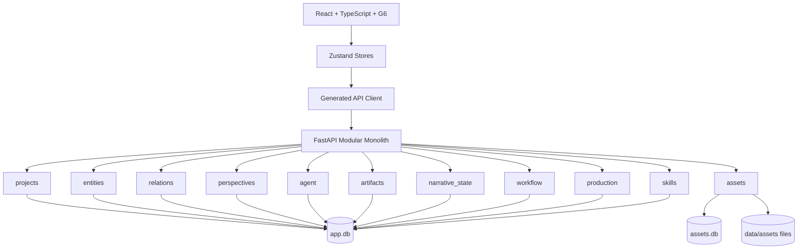

继续保留：模块化单体、SQLite 本地优先、跨领域 service 边界、import-linter、Agent 不直接拥有领域事实、显式确认写入、仓库事实优先。

## 1.2 Artifact Core 已经是可工作的版本基础设施

当前已实现：稳定 Artifact ID、稳定 Block ID、immutable revision、完整 block snapshot、block-local diff、dependency、localized stale、并发 revision 冲突和不自动删除下游。

这已经证明：

```text
B42 rev6 → rev7
```

不需要整集重建。

## 1.3 Narrative State 已经拥有事件账本

当前已有：

```text
NarrativeTimepoint
StateEvent
StateCurrent
StateSnapshot
Claim
KnowledgeState
```

并已有 `compensates_event_id`。所以 Narrative State 的纠错应继续走 compensation event，不能直接重写历史事件。

## 1.4 Workflow 已经承担流程控制

已有：

```text
RequirementSpec
WorkflowSeries
Episode
ScenePlan
WorkflowGate
ExecutionRun
ExecutionStep
```

未来 Timeline Gate、Director Gate、Voice Timing Gate、Generation Gate 都应继续由确定性代码承担，而不是放进 Prompt。

## 1.5 Production Documents 已实现，但当前模型过于线性

当前硬编码：

```text
Screenplay
→ Production Breakdown
→ Performance Script
→ Shot Plan
→ Storyboard
→ Timeline
```

这对 R5 验证基本生产文档成立是合理的，但真实影视生产会出现 Rough Voice、Timing、Previz、Animatic、Final Voice、Music、Generation 等并行/回流节点。V4 不应继续往一个 `DOCUMENT_ORDER` 里堆十几个类型。

## 1.6 Atomic Skill 已有正确候选边界

当前：

```text
Skill Contract
→ Context/gate/schema validation
→ ExecutionRun
→ SkillCandidate
→ impact
→ pending
→ accept/reject
→ bounded commit adapter
```

继续保留。但当前 commit adapter 只有 `none / edit_block / create_production_document`；未来不能演化成一个巨大 if/elif。应改成注册式领域写入 adapter，并与 Active Agent Plan G 协调。

## 1.7 Agent 可靠性能力必须保留

现有 Agent 已具备 project scope、author/character/audience context partition、budget、tool quota、durable AgentRun、SSE replay、cancel/recovery、pending write 原子确认、source-backed summary、原文恢复、project long-term memory、proposed/accepted/disputed/superseded、forget preview、tombstone。

硬边界：

```text
Agent Long-term Memory
≠ Canon
≠ Narrative State
≠ Artifact
≠ Design Contract
≠ Timeline
```

Memory 只承载有来源的创作指导/偏好/决策/未决事项，不成为第二份项目真相。

## 1.8 当前最明显的前端断层

后端已经拥有 Workflow、Production、Artifact、Narrative State、Skills；但当前 `frontend/src/App.tsx` 主产品路由仍基本只有：

```text
/projects
/projects/:projectId/graph
/projects/:projectId/assets
/projects/:projectId/agent
```

Workbench 主导航仍是：

```text
图谱 | 资产管理 | Agent
```

默认落点仍是 Graph。

结论：**后端已经是生产系统底座，前端仍像世界观工作台。** V4 前端不是“美化”，而是把已存在能力真正呈现给用户。

---

# 2. 当前实现的关键缺口

1. `ArtifactDependency` 只有 source block/revision→dependent artifact + `is_stale`，无法表示跨 Design/Timeline/Media/Previz 的依赖，也没有 invalidation policy、rebase、reverse proposal。
2. `Artifact.status` 主要承担 draft/stale，混淆 approval lifecycle 与 freshness。
3. `narrative_timepoints` 已是故事时间，但成片 Media Time 仍只是普通 `start/duration` 字段。
4. 现有 `assets.db`/`AssetImage` 只适合参考图片，不适合 voice/music/video/depth/pose/whitebox/generated takes。
5. 当前没有 Creative Design 一等领域；视觉风格、角色视觉、服装、地点、道具、Voice Profile、Sound Motif 无统一长期版本/批准边界。
6. 当前没有 Director Previz 领域。
7. 当前没有独立 Generation Job / Provider Adapter 领域。
8. Episode/Scene planning 目前不是完整版本化 Artifact 血缘，后续如需局部影响分析要渐进补强。
9. 当前 Production 的 Timeline 只是 production document block，不足以承担真正 playable production SSOT。
10. 当前前端没有 Workflow/Production/Skill 的主工作流入口。
11. 当前没有 Prompting 一等领域：视觉资产提示词仍主要以聊天式/人类阅读式文档生成，状态、缺失数据、建议、最终提示词混在同一输出中，无法直接成为自动生图的稳定机器输入。
12. 当前没有“视觉资产清单 → 单资产合同 → 结构化 Prompt Spec → 编译结果 → Generation Job → Media Take”的正式生产链，也没有为大量单资产合同/提示词提供统一的数据身份、版本、来源与进度管理。
13. 当前视觉 Prompt 缺少确定性的 Blueprint / Preset / Compiler：全局风格、版式、相机、光影背景、特殊效果、实体视觉内容与负面提示词没有被分层建模，Provider 输入仍容易退化为一次性自由文本。

---

# 3. V4 最高级原则

## 3.1 One Fact, One Owner

| 事实 | 唯一 Owner |
|---|---|
| 世界稳定事实 | entities / relations / claims |
| 人物随故事变化的伤势、位置、知识 | narrative_state |
| 用户长期创作偏好/决策提示 | agent project memory |
| 文本创作块 | Artifact revision |
| 世界/人物/视觉/声音设计合同 | Creative Design |
| 某集/某场需要生产哪些视觉资产 | Production / Visual Asset Manifest |
| 视觉提示词的结构化规格、模板解析与编译规则 | Prompting |
| 视觉提示词是否已规划/编译/复核/可生成 | Workflow（resource-scoped stage state） |
| 某次真正提交给图像模型的精确 Prompt 快照 | Prompt Compilation / Generation input snapshot |
| 某镜头为什么这样拍 | Shot Plan |
| 某镜头三维空间与相机逐帧状态 | Director Previz |
| 媒体文件本身 | Media Registry + file store |
| 媒体在成片哪里出现 | Timeline |
| 模型生成任务状态 | Generation |
| 下游要求上游修改 | Change Proposal |

## 3.2 向下传播影响，不能向上静默改事实

```text
Upstream revision
→ dependency evaluation
→ downstream freshness / review
```

自动做影响分析，绝不自动删除或收费重生成。

## 3.3 下游只能用 Change Proposal 向上反馈

```text
Downstream finding
→ Change Proposal
→ user accept
→ target owner creates new revision/event
→ impact analysis
→ rebase / stale / blocked
```

修改发生在哪个页面不决定 Owner，修改的“事实属于哪个 Domain”才决定 Owner。

## 3.4 回滚不重写历史

已提交内容统一采用“新 revision 恢复旧内容”或 compensation event，不允许偷偷把 current pointer 倒回旧版本并抹去中间历史。

---

# 4. V4 目标架构

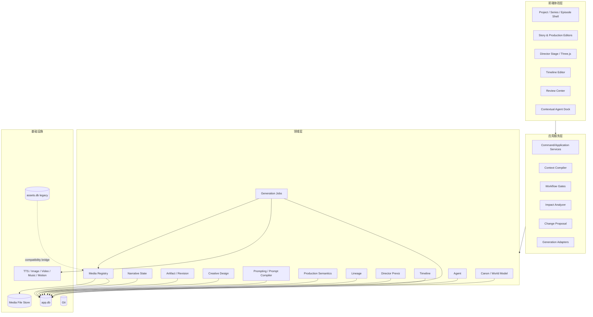

---

# 5. 完整真实影视生产流程

“全局数据”不是一个步骤，而是横向长期数据层。视觉资产生产也不是“Skill 输出一篇 Prompt 文档”，而是独立的、可追溯的生产支线。

```mermaid
flowchart LR
    subgraph GLOBAL[全局长期设计流]
      WORLD[世界观 / Canon]
      CHAR[人物设定]
      VSTYLE[视觉风格合同]
      VDES[人物/服装/场景/道具设计合同]
      SSTYLE[声音风格]
      VOICE[Voice Profiles]
      MOTIF[Sound / Music Motifs]
    end

    subgraph STORY[故事流]
      STORY0[故事草案]
      SERIES[Series / Arc]
      EP[分集规划]
      SCENE[Scene Plan]
      SCRIPT[单集剧本]
    end

    subgraph ASSET[视觉资产生产流]
      MANIFEST[Visual Asset Manifest / 资产清单]
      DESIGNID[Design Binding / 单资产身份]
      CONTRACT[Asset Contract / 单资产合同]
      PSPEC[Structured Prompt Spec]
      PCOMP[Prompt Compiler]
      CPrompt[Compiled Prompt Snapshot]
      IMGJOB[Image Generation Job]
      IMAGES[Media Takes / 一张多面板资产图]
      AIMG[Approved Visual Asset]
    end

    subgraph PROD[单集生产流]
      BREAK[Production Breakdown]
      PERF[Performance Script]
      SHOT0[文字 Shot Plan v0]
      ROUGH[Rough Voice / Timing Proxy]
      TIMING[Shot Timing Pass]
      SHOT1[Shot Plan v1]
      SB[Storyboard]
      KF[关键帧视觉参考]
      PREVIZ[Director Previz / 白模]
      ANIM[Animatic]
      LOCK[Timing Lock]
      FVOICE[Final Voice]
      MUSIC[Music / SFX]
      MASTER[Master Timeline]
      CTRL[Control Compiler]
      VIDEO[Video Generation]
      APPROVE[Approved Media]
      FINAL[Final Timeline / Delivery]
    end

    WORLD --> STORY0
    CHAR --> STORY0
    STORY0 --> SERIES --> EP --> SCENE --> SCRIPT

    VSTYLE --> VDES
    CHAR --> VDES
    SSTYLE --> VOICE
    CHAR --> VOICE
    SSTYLE --> MOTIF

    SCRIPT --> BREAK --> PERF --> SHOT0
    SCRIPT --> MANIFEST
    PERF --> MANIFEST
    MANIFEST --> DESIGNID
    VDES --> DESIGNID
    DESIGNID --> CONTRACT
    VSTYLE --> PSPEC
    CONTRACT --> PSPEC --> PCOMP --> CPrompt
    CPrompt --> IMGJOB --> IMAGES --> AIMG

    VOICE --> ROUGH
    PERF --> ROUGH
    SHOT0 --> ROUGH --> TIMING --> SHOT1
    SHOT1 --> SB --> KF
    AIMG --> SB
    AIMG --> PREVIZ
    VDES --> PREVIZ
    PERF --> PREVIZ
    SHOT1 --> PREVIZ
    KF --> PREVIZ --> ANIM --> LOCK
    ROUGH --> ANIM
    LOCK --> FVOICE
    LOCK --> MUSIC
    FVOICE --> MASTER
    MUSIC --> MASTER
    PREVIZ --> MASTER
    MASTER --> CTRL
    PREVIZ --> CTRL
    VDES --> CTRL
    CTRL --> VIDEO --> APPROVE --> FINAL
```

视觉资产流中的 `Compiled Prompt` 是可审计的编译产物，不是设计事实；`Media Take` 是生成结果，也不能反向覆盖 Asset Contract。人物三视图、面部近景、表情、细节等默认作为**同一张资产 Sheet 内的多个 Panel**组织，而不是默认拆成多个独立生成任务。

---

# 6. Rough Voice 必须前移

## 6.1 正式身份：Timing Proxy（对白时间代理）

它不是“低质量最终配音”，唯一必须可靠回答：

> 这句按目标表演真正说出来大约需要多久？

正确位置：

```text
Performance Script
+
文字 Shot Plan v0（台词已分配到镜头，但时长未锁）
↓
Timing Proxy
↓
Dialogue Alignment
↓
Shot Timing Pass
↓
Shot Plan v1
↓
Storyboard / Previz
```

## 6.2 Shot duration 必须分成熟阶段

```text
estimated
budgeted
locked
```

示例：

```json
{
  "shot_id": "SH018",
  "duration_stage": "budgeted",
  "duration_estimate": {"min_frames": 72, "max_frames": 108, "rate": 24},
  "timing_budget": {
    "dialogue_frames": 65,
    "pre_roll_frames": 8,
    "reaction_frames": 12,
    "action_frames": 10,
    "handles_frames": 4,
    "total_frames": 99
  },
  "timing_source_refs": ["timing-proxy:D018@v2"]
}
```

粗配音把最容易被低估的“语言时间”提前变成可测数据，但不等于最终 Picture Lock。


---

# 7. Creative Design Domain

## 7.1 为什么必须是一等领域

以下长期生产事实不属于 Character Domain，也不属于某一集：

```text
视觉风格
角色视觉设计
服装设计
场景设计
地点空间布局
重要道具设计
Voice Profile
Sound Style
Sound Motif
Music Style
```

更不能让某张偶然生成图/音频反向定义这些事实。

建议新增：

```text
backend/app/design/
```

职责：design identity、design kind、owner binding、semantic contract、approval、approved revision、media refs、lineage。

## 7.2 Revision 不重复造轮子

Design 正文继续复用 Artifact Core；新增 `design_bindings` 只做语义绑定：

```sql
id
project_id
series_id NULL
owner_type
owner_id
design_kind
artifact_id
approved_revision_id NULL
created_at
updated_at
```

建议 Artifact types：

```text
visual_style
character_visual
costume_design
location_design
location_layout
prop_design
voice_profile
sound_style
sound_motif
music_style
```

关系：

```text
Design Domain = 类型、Owner、批准、读取规则
Artifact Core = revision 基础设施
```

## 7.3 Location Layout 与 Spatial Anchor

地点布局要输出可长期引用的语义锚点。例如：

```json
{
  "anchor_id": "blk-anchor-side-gate",
  "name": "侧门入口",
  "anchor_type": "area",
  "geometry": {
    "shape": "rect",
    "center": [4.2, 0.0, -2.8],
    "size": [1.4, 2.2]
  }
}
```

第一版可直接让 Anchor 成为 Design Artifact 内的稳定 block；Director 引用 `block_id + source_revision`。不必预先再建一整套 Anchor 数据库。

---

## 7.4 Visual Asset Production：资产不是一篇 Prompt 文档

真实视觉资产生产链固定为：

```text
Screenplay / Performance Script
↓
Visual Asset Manifest（资产清单）
↓
Design Binding（稳定单资产身份）
↓
Asset Contract（正式视觉事实）
↓
Prompt Spec（结构化生成规格）
↓
Prompt Compiler
↓
Compiled Prompt Snapshot
↓
Generation Job
↓
Media Variants
↓
Approved Visual Asset
```

这几层必须分开，因为它们回答不同问题：

| 层 | 负责回答 | Owner |
|---|---|---|
| Visual Asset Manifest | 这一集/场需要做哪些视觉资产？ | Production + Artifact Core |
| Design Binding | 我们现在说的是哪一个长期资产/变体？ | Creative Design |
| Asset Contract | 这个资产正式应该长什么样？ | Creative Design + Artifact Revision |
| Prompt Spec | 这次生成应该如何分层组织输入？ | Prompting |
| Compiled Prompt | 此版本真正发送给模型的精确文本/载荷是什么？ | Prompting 派生产物 / Generation input snapshot |
| Generation Job | 哪个 Provider 用什么参数执行了什么任务？ | Generation |
| Media Variant | 模型实际产生了什么文件？ | Media Registry |

禁止把“合同事实、工作流状态、缺失信息、待确认建议、最终 Prompt”继续塞进一篇人类聊天式文档。

## 7.5 Visual Asset Manifest：大量资产需求仍复用 Artifact Core

资产清单适合继续复用已有 Artifact / Block / Revision，而不是新增一套文档引擎：

```text
artifact_type = visual_asset_manifest
scope = episode / scene / project
```

每一个资产需求是稳定 Block，例如：

```text
blk-asset-001  陈知澜·基础人物资产
blk-asset-002  陈知澜·晨练服装
blk-asset-003  承天阁修习场
blk-asset-004  软柱
blk-asset-005  承天阁门匾
```

Block 的 `semantic_json` 至少保存：

```json
{
  "asset_category": "prop",
  "name": "软柱",
  "source_refs": ["screenplay:B42@rev7"],
  "required_for": ["SC05", "SH018"],
  "reuse_intent": "series_reusable",
  "design_id": null
}
```

这样上游剧本局部修改只影响真正引用该 block 的资产需求，不让整份资产清单一起失效。

## 7.6 单资产合同：Skill 分类可以不同，存储基础设施必须统一

人物、服装、道具与文书、场景等 Skill 可以拥有不同 Schema / Validator / Context Contract，但数据库不能按 Skill 数量复制四五套 revision 表。

继续使用：

```text
Design Binding
→ contract artifact_id
→ Artifact Core blocks/revisions
```

`design_kind` 至少支持：

```text
character_visual
costume_design
prop_design
document_prop_design
location_design
location_layout
```

共同合同外壳由稳定字段组成，类别差异放在 `semantic_json.category_payload`：

```json
{
  "schema_version": 1,
  "design_id": "design-czl-base",
  "asset_category": "character",
  "locked_features": [],
  "allowed_variation": [],
  "reference_roles": [],
  "category_payload": {}
}
```

人物、服装、道具、文书、场景分别拥有不同 `category_payload` schema；但版本、批准、来源、diff、lineage 继续复用 Artifact Core。

## 7.7 Prompting Domain：Prompt 不是 Artifact 文档，而是可编译结构

新增：

```text
backend/app/prompting/
```

职责只包括：

- Prompt Blueprint / Preset 发现；
- Prompt Spec 结构化数据；
- Prompt Spec revision；
- Prompt Compiler；
- Prompt validation；
- exact compiled prompt snapshot；
- 面向前端的 HTML/View Model；
- Prompt Spec → Generation input 的受控交接。

它不负责：

- 重新设计资产；
- 决定资产正式事实；
- 保存工作流进度；
- 调用图像 Provider；
- 保存图片文件。

## 7.8 Prompt Blueprint 与 Preset：像编译器模板，不靠 Skill 每次自由写

系统级、相对稳定的视觉 Prompt 规则应成为**仓库版本化的声明式模板**，而不是每个聊天 Skill 重复一遍。建议：

```text
backend/app/prompting/blueprints/
  character_standard_sheet.v1.json
  costume_sheet.v1.json
  prop_sheet.v1.json
  document_prop_sheet.v1.json
  location_sheet.v1.json

backend/app/prompting/presets/
  camera/
  render/
  sheet_layout/
```

Blueprint 定义：

- 允许/要求哪些 Prompt layer；
- 对应资产类别需要哪些实体字段；
- 哪些字段必填、哪些可选；
- 使用哪个 Sheet Layout；
- 默认 Camera / Render Preset；
- 编译顺序；
- Provider-neutral validation rules。

这些模板属于代码/配置，跟随 Git 版本；项目自己的美术风格不写死在 Blueprint 中，而继续来自项目 `visual_style` Design revision。

## 7.9 Prompt AST：统一七层结构

真正的 Prompt Spec 不保存“状态、缺失关键数据、建议”等人类报告段落。它保存可机器编译的 Prompt AST：

```json
{
  "schema_version": 1,
  "blueprint_ref": "character_standard_sheet@v1",
  "source_refs": {
    "visual_style_revision": "...",
    "asset_contract_revision": "..."
  },
  "layers": {
    "style": {},
    "output_format": {},
    "camera": {},
    "render": {},
    "effects": {},
    "entities": [],
    "negative": {}
  },
  "user_overrides": {}
}
```

七层语义固定为：

```text
1. style
   统一项目美术风格；通常来自 approved Visual Style revision

2. output_format
   图像尺寸、画幅、Sheet Layout、Panel 结构

3. camera
   相机、焦段、景别、拍摄角度、透视规则

4. render
   光影、构图、景深、背景、材质展示环境

5. effects
   墨彩、颗粒、晕染等仅影响视觉表现的特殊效果

6. entities
   人物/服装/道具/文书/场景等具体实体的详细视觉内容、细节、特殊要求

7. negative
   全局与资产针对性负面提示词
```

页面默认只展开 `entities`；其他层折叠，但都可查看和按权限编辑。

## 7.10 Sheet Layout：三视图、表情、细节默认是同一张图的 Panel

人物三视图、面部近景、表情、服装细节、配件细节等默认不是多个独立 Generation Job，而是一个 `sheet_layout` 下的多个 panel：

```json
{
  "sheet_layout": "character_standard_sheet",
  "panels": [
    {"role": "front_fullbody"},
    {"role": "true_side_90_fullbody"},
    {"role": "back_fullbody"},
    {"role": "midshot_head_to_waist"},
    {"role": "expression_strip"},
    {"role": "detail_insets"}
  ]
}
```

类似地：

```text
costume_sheet
prop_turnaround_sheet
document_prop_sheet
location_concept_sheet
```

都描述**一张输出图片内部如何排版**。只有用户明确选择拆分输出时，系统才把某个 Panel 派生成单独 Prompt Spec / Generation Job。

## 7.11 Prompt Spec 持久化

建议：

```sql
prompt_specs
  id
  project_id
  design_id
  purpose_kind
  blueprint_id
  current_revision_id
  created_at
  updated_at

prompt_spec_revisions
  id
  prompt_spec_id
  revision_no
  prompt_ast_json
  source_refs_json
  created_by
  created_at
```

**不得在 `prompt_ast_json` 中保存 workflow status。**

“提示词是否未生成 / 已规划 / 已编译 / 待复核 / 可生成 / 已出图”属于 Workflow，而不是 Prompt 数据。

## 7.12 Prompt Compilation：保存精确输入快照，但它不是第二事实源

Prompt Compiler 使用：

```text
Prompt Spec revision
+ Visual Style revision
+ Asset Contract revision
+ Blueprint version
+ Sheet/Camera/Render presets
+ Provider profile
```

确定性编译为：

```text
positive prompt text
negative prompt text
provider-neutral structured payload
```

建议保存不可变 `prompt_compilations`：

```sql
id
project_id
prompt_spec_revision_id
compiler_version
blueprint_version
provider_profile_id NULL
positive_text
negative_text
payload_json
source_manifest_json
created_at
```

用途是：

- 页面预览；
- diff；
- 审计；
- 确保 Generation Job 能准确说明“当时模型实际收到了什么”。

它仍然是派生产物。正式设计事实只来自 Contract；Prompt Spec 只负责生成规格。若上游 Contract/Style revision 改变，旧 compilation 保留历史但进入 stale/recompile 路径。

## 7.13 Workflow 状态必须与 Prompt 内容分离

视觉资产生产应由 Workflow Core 增加 resource-scoped stage state（名称可在实现时确定），至少能表达单个资产的：

```text
identified
contract_required
contract_draft
contract_approved
prompt_required
prompt_spec_ready
prompt_compiled
prompt_review_required
generation_ready
generating
candidates_ready
asset_approved
blocked
needs_review
```

具体表结构不得为了本段文字机械照搬；关键约束是：

- workflow state 的 Owner 是 Workflow；
- Prompt AST 中没有“状态”字段；
- Asset Contract 正文中没有“是否已出图”字段；
- Media Asset 中没有“上游 Prompt 是否批准”字段；
- UI 通过统一 Workflow projection 显示进度。

## 7.14 缺失数据、建议和校验结果属于 Findings，不属于 Prompt

旧聊天式 Skill 输出里的内容迁移为：

| 旧内容 | 新 Owner |
|---|---|
| 状态 | Workflow |
| 缺失关键数据 | Validation Findings / Gate reasons |
| 待确认建议 | Candidate / Review Suggestions |
| 资产事实 | Asset Contract source |
| 最终生成提示词 | Prompt Compilation |
| 负向约束 | Prompt AST `negative` layer |
| 资产合同摘要 | Source refs / UI summary projection |

Validator 输出独立结构：

```json
{
  "errors": [],
  "warnings": [],
  "missing_required_fields": [],
  "source_conflicts": []
}
```

前端可以展示这些信息，但 Compiler 绝不把它们混进最终生图 Prompt。

## 7.15 HTML 原则：HTML 是人类界面，Compiler 不解析 HTML/Markdown

本项目继续坚持“用户可见文档/页面以 HTML 形态呈现，而不是 Markdown 文档堆积”。但 Prompting 的机器真相仍然是结构化数据：

```text
Prompt AST / Contract semantic data
↓
HTML View Model / Editor
```

禁止：

```text
Markdown / HTML 自由文本
→ 运行时再让 LLM 猜字段
→ 编译 Prompt
```

页面上的修改必须写回明确的结构化 layer / entity field / override，再重新编译。HTML 是展示与编辑表面，不是另一个需要手工同步的事实副本。

## 7.16 Visual Asset Workspace：一个资产一个工作页，不把上百份文档铺给用户

推荐路由：

```text
/projects/:pid/create/visual/assets
/projects/:pid/create/visual/assets/:designId
```

单资产页面：

```text
┌ 资产名称 ──────────────────────────────────────┐
│ 生产进度：合同 → Prompt → 出图 → 批准          │
├───────────────────────────────────────────────┤
│ [概览] [合同] [提示词] [图片] [历史]            │
├───────────────────────────────────────────────┤
│ 提示词页：                                     │
│ ▼ 实体视觉内容（默认展开）                      │
│ ▶ 统一风格                                     │
│ ▶ 输出格式 / Sheet Layout                      │
│ ▶ 相机 / 焦段 / 景别 / 角度                    │
│ ▶ 光影 / 构图 / 景深 / 背景                    │
│ ▶ 特殊效果                                     │
│ ▶ 负面提示词                                   │
│ ▶ 编译后 Prompt                                │
└───────────────────────────────────────────────┘
```

用户修改的是结构化层字段；页面即时标记 override、来源、缺失项，并允许重新编译。默认不要求用户面对 `Artifact ID`、`Prompt AST JSON`、`Generation payload`。

## 7.17 Skill 迁移边界：先搭系统，再批量修订 Skill

V4-R3 的目标是**先把输入地址、输出地址、Schema、Blueprint、Compiler、Workflow state、HTML Workspace 和写入边界搭好**。

本阶段明确不做：

- 批量重写现有视觉 Skill；
- 让旧聊天型 Skill 直接写 `prompt_specs`；
- 从旧 Skill 的 Markdown/HTML 输出反向解析 Prompt AST；
- 为兼容旧 Skill 而污染新的 Prompting Schema。

现有 `visual-asset-prompt-write` 等 Skill 只作为“字段需求/创作规则参考资料”。系统接口稳定后，再由独立的 **Skill 修订要求文档** 统一规定：

```text
旧人类聊天式 Skill
→ 结构化 required/optional input contract
→ typed candidate output
→ validator contract
→ commit target
→ workflow handoff
```

该 Skill 批量修订是后续独立 initiative，不属于 V4-R3 的完成条件。

---

# 8. Media Registry

## 8.1 不把旧 AssetImage 扩成万能媒体

现有 `assets.db / AssetRecord / AssetImage / data/assets` 继续承担通用参考图库与实体图片页的兼容职责。

新增：

```text
backend/app/media/
```

Media metadata 进入主 `app.db`，重媒体文件外置。

## 8.2 media_assets

建议：

```sql
id
project_id
kind
mime
uri
sha256
size_bytes

duration_value NULL
duration_rate NULL

width NULL
height NULL
channels NULL
sample_rate NULL
frame_rate_num NULL
frame_rate_den NULL

origin_type
origin_ref
availability_status
created_at
```

`kind` 至少支持：

```text
reference_image
design_image
storyboard
keyframe
voice
music
sfx
whitebox_video
depth
pose
generated_video
proxy_video
final_master
```

MediaAsset 表示真实不可变文件；文件内容变化必须是新 asset id。

## 8.3 多 Take / Variant

建议 `media_variants`：

```sql
id
project_id
purpose_type
purpose_id
asset_id
take_no
generation_job_id NULL
approval_status
created_at
```

状态：

```text
candidate
approved
rejected
superseded
```

例：

```text
D018
├─ take01
├─ take02
├─ take03 ✅
└─ take04
```

## 8.4 文件存储

首版：

```text
data/media/
  <project-id>/
    audio/
    image/
    video/
    control/
    render/
```

业务身份始终是 `media_asset_id`，不是物理路径。`sha256` 用于完整性和去重判断。

---

# 9. Cross-domain Lineage Core

## 9.1 为什么现有 ArtifactDependency 不够

V4 将存在：

```text
Voice Profile revision → Rough Voice
Rough Voice → Shot Timing
Asset Contract revision → Prompt Spec
Visual Style revision → Prompt Spec
Prompt Spec revision → Prompt Compilation
Prompt Compilation → Image Generation Job
Image Generation Job → Media Variant
Location Layout revision → Previz
Previz → Whitebox / Prompt Facts / Generation Job
Final Voice → Timeline Clip
Timeline revision → Control Package
```

这些不全是 Artifact→Artifact。

因此新增：

```text
backend/app/lineage/
```

目标是让它成为跨领域 lineage 的唯一 Owner。现有 `artifact_dependencies` 渐进迁移，不长期双写两套事实。

## 9.2 lineage_edges

建议：

```sql
id
project_id

upstream_type
upstream_id
upstream_revision_ref NULL

downstream_type
downstream_id
downstream_revision_ref NULL

dependency_type
invalidation_policy
compatibility_validator NULL

state
stale_cause_ref NULL

created_at
updated_at
```

`dependency_type`：

```text
structural
semantic
timing
visual
state
spatial
media
generation_input
reference
```

`invalidation_policy`：

```text
hard_stale
review_required
timing_revalidate
compatibility_check
notice_only
none
```

Edge state：

```text
active
stale
superseded
rebased
```

Downstream 整体 freshness 由 active dependency 投影得出：

```text
VALID
STALE
BLOCKED
```

不要再让一个 `Artifact.status=stale` 独自承担所有含义。

---

# 10. Change Proposal：下游如何安全更新上游

## 10.1 正向依赖与反向反馈不是同一条边


正向依赖可以自动做影响分析；反向修改必须经过 Proposal + 用户确认 + Target Owner。

## 10.2 change_proposals

```sql
id
project_id

origin_type
origin_id
origin_revision_ref NULL

target_type
target_id
target_base_revision_ref NULL

proposal_kind
patch_json
rationale
evidence_json

status
committed_ref NULL
created_by
created_at
decided_at NULL
```

状态：

```text
proposed
accepted
rejected
superseded
```

## 10.3 白模发现剧本动作问题的流程

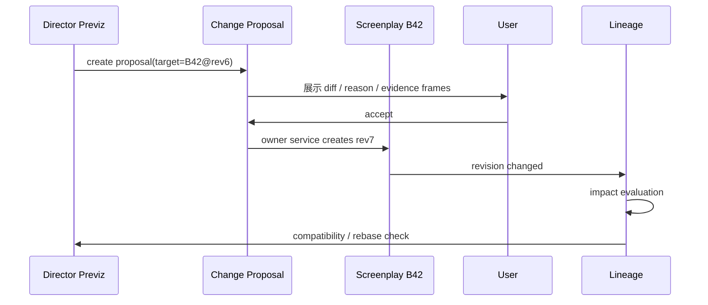

---

# 11. Rebase：避免下游提议上游修改后把自己误判 stale

例：`PV18-R3` 本来就是按其提议的新逻辑制作的。它提出：

```text
B42@rev6 → B42@rev7
```

新 revision 获批后，Lineage 运行 compatibility validator：

```text
PV18-R3 是否已经符合 B42@rev7？
```

若兼容：

```text
PV18-R4
content unchanged
source_ref: B42@rev6 → B42@rev7
```

称为 Rebase（重新挂靠）。若不兼容，才真正 stale。

---

# 12. Artifact 生命周期：审批状态与新鲜度必须拆开

## 12.1 Approval Lifecycle

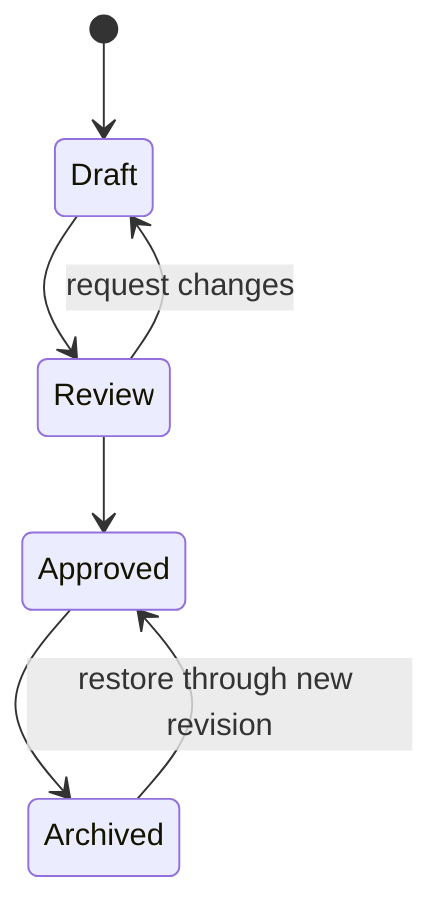

## 12.2 Freshness

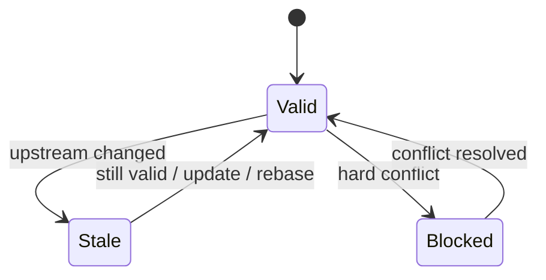

一个 Artifact 完全可能同时：

```text
approval_status = approved
freshness = stale
```

意思是：曾经批准，但来源变化，需要复核。

---

# 13. 回滚、Undo、Revert 的统一规则

## 13.1 层 1：UI 临时 Undo

尚未形成 canonical revision 的编辑：文本输入、拖关键帧、移动相机等，使用前端本地 Command Stack。不要每个 mousemove 都写 DB。

## 13.2 层 2：已提交内容 Revert

```text
rev5
rev6
rev7
↓ revert to rev5 content
rev8
```

rev8 内容可与 rev5 相同，但历史 rev6/rev7 永远保留。

## 13.3 领域级回滚表

| Domain | 回滚方式 |
|---|---|
| Artifact | 新 revert revision |
| Narrative State | compensation event |
| Design | 新 design revision / 重新批准 |
| Timeline | 新 Timeline revision |
| Director Previz | 新 Previz revision |
| Media approval | 切换 approved variant，保留旧 take |
| Generation Job | 不回滚调用；cancel / retry 是新 attempt |
| Skill Candidate | accept 前 reject；accept 后走 owner revert |
| AgentRun | terminal immutable；重跑是新 run |

---

# 14. Timeline Core：从普通 Production Document 升级为 playable SSOT

## 14.1 Production 文档链应收敛

V4 推荐核心文档链变为：

```text
Screenplay
→ Production Breakdown
→ Performance Script
→ Shot Plan
→ Storyboard
```

Timeline 提升到独立：

```text
backend/app/timeline/
```

旧 `ProductionDocumentType=timeline` 保留可读并提供 importer，不立即删除历史。

---

# 15. OpenTimelineIO 思想在本项目中的具体使用

我们不是直接把 OTIO 当数据库，而是借成熟时间概念。

## 15.1 RationalTime（精确时间值）

不要长期保存：

```text
2.5416666667 秒
```

保存：

```json
{"value": 61, "rate_num": 24, "rate_den": 1}
```

表示第 61 帧 @ 24fps。未来 23.976 可以用 `24000/1001`，避免浮点累计误差。

## 15.2 source_range

表示“从源素材内部取哪一段”。

```text
SH018_take07.mp4 共 120f
真正使用 12f → 108f
source_start=12f
source_duration=96f
```

## 15.3 placement_range

对应 OTIO 的 `range_in_parent` 思想，但数据库里建议叫更直白的 `placement_range`：

> 这段素材在父 Timeline 里放在哪里。

```text
source_range: 素材内 12f → 108f
placement_range: EP01 3280f → 3376f
```

粗配音换正式配音时，通常只换 source/media，不换 placement，这正是提前做 Timing Proxy 的价值。

---

# 16. Timeline 数据模型

## 16.1 timelines

```sql
id
project_id
series_id
episode_id
rate_num
rate_den
current_revision_no
approval_status
lock_level
created_at
updated_at
```

## 16.2 timeline_tracks

```sql
id
timeline_id
track_kind
role
position
group_key NULL
enabled
```

首版 track：

```text
video
dialogue
camera
performance
sfx
music
state
review
generation
```

## 16.3 timeline_items

稳定 identity：

```sql
id
timeline_id
track_id
item_kind
source_type
source_id
created_at
```

`item_kind`：

```text
clip
gap
transition
marker
cue
```

## 16.4 timeline_revisions

```sql
id
timeline_id
revision_no
created_by
reason
created_at
```

## 16.5 timeline_item_revisions

第一版可像 Artifact 一样做完整 snapshot，优先正确性：

```sql
id
timeline_revision_id
timeline_item_id

placement_start_value
placement_start_rate_num
placement_start_rate_den
placement_duration_value
placement_duration_rate_num
placement_duration_rate_den

source_start_value NULL
source_start_rate_num NULL
source_start_rate_den NULL
source_duration_value NULL
source_duration_rate_num NULL
source_duration_rate_den NULL

enabled
semantic_json
```

等真实性能证据表明 snapshot 成本过高，再优化，不提前发明复杂 event store。

## 16.6 timeline_bindings

连接 Story Time 与 Media Time：

```sql
id
timeline_item_id
narrative_timepoint_id NULL
scene_id NULL
beat_id NULL
shot_id NULL
binding_role
```

允许一个 Narrative Timepoint 出现在多个 Media Range，也允许蒙太奇式一个 Media Range 映射多个 narrative refs。

---

# 17. Clip / Gap / Transition 的产品语义

## Clip

任何有时间范围的素材：视频 Shot、粗配音、正式配音、音乐、音效、白模视频。

## Gap

明确且有意的空白时间。例如木野说完“没事吧？”之后的 0.6 秒沉默。这不是“没做”，而是表演的一部分。

## Transition

两个 Clip 的时间连接关系，如视频 dissolve、audio/music crossfade。推镜、摇镜、环绕不是 Transition，它们属于 Camera Track / Director。

---

# 18. Timing Proxy 与 Audio Alignment

## 18.1 timing_proxies

```sql
id
project_id
episode_id
scene_id

dialogue_ref
performance_beat_ref
shot_ref NULL
voice_profile_revision_ref

generation_job_id
media_asset_id
alignment_id NULL

measured_duration_value
measured_duration_rate
status
created_at
```

状态：

```text
candidate
accepted
superseded
```

## 18.2 audio_alignments

```sql
id
media_asset_id
alignment_kind
rate
segments_json
created_at
```

例如以 48kHz sample 为时间单位保存 word/phoneme 区间。以后字幕、Lip Sync、对白 Timeline 共用，不需要重复对齐。

## 18.3 Rough → Final 的低代价替换

若 Timing Proxy 已占：

```text
EP01 frame 3240 → 3330
```

最终 Voice Take 原始文件 4.4s，但有效表演 source range 恰好 3.75s，则只替换：

```text
media_asset_ref
source_range
```

保持 `placement_range` 不变，Shot、白模、音乐节奏都无需重做。

## 18.4 Timing Conflict

若 allocated=90f、final voice=103f，系统产生：

```text
TIMING_CONFLICT overflow=13f
```

用户选择：

```text
A 重新配音（<=90f）
B 延长 Shot 13f，并预览下游影响
C 创建 Script Change Proposal
```

系统不得静默加速、删台词或拉长整条 Timeline。

---

# 19. Director Previz Domain

新增：

```text
backend/app/director/
```

但逐帧数学核心不建议 Python/TypeScript 各写一份。

## 19.1 Host-agnostic Director Core

建议 monorepo 增加：

```text
packages/
  director-core/
    src/
      schema/
      time/
      interpolation/
      spatial/
      camera/
      motion/
      evaluator/
      validators/
      compiler/
```

使用 TypeScript；必须不依赖 React、Three.js、FastAPI、数据库；输入输出全部可序列化；同输入永远同输出。

核心函数心智：

```text
PrevizRevision + time
→ FrameState
```

输出 camera / instances / active shot / markers / diagnostics。

## 19.2 为什么 Core 不依赖 Three.js

Three.js 只是 Renderer Adapter：

```text
FrameState → Three scene objects
```

同一个 Core 还要服务 browser preview、geometry probe、prompt fact compiler、whitebox renderer、tests。

## 19.3 前端 Three.js 结构

```text
frontend/src/director/
  DirectorStage.tsx
  DirectorEngine.ts
  DirectorInspector/
  DirectorTimeline/
```

保持类似现有 G6 的 imperative lifecycle：React 管页面/selection/inspector/command；Three Engine 管 scene/camera/renderer/gizmo/picking/frame application。不要每 1/24 秒重渲整棵 React DOM。

---

# 20. Previz 数据模型

## 20.1 previz_sequences

```sql
id
project_id
episode_id
scene_id
name
current_revision_no
approval_status
created_at
updated_at
```

## 20.2 previz_revisions

第一版使用 scene-sized immutable JSON snapshot：

```sql
id
previz_sequence_id
revision_no
source_refs_json
scene_json
change_reason
created_by
created_at
```

不要第一版就为每个 x/y/z 建几十张表。真实需要查询单个 keyframe 时再 normalize。

## 20.3 scene_json 核心形态

```json
{
  "schema_version": 1,
  "rate": {"num": 24, "den": 1},
  "location_layout_ref": "design:location-layout@rev3",
  "instances": [
    {
      "id": "inst-czl",
      "entity_ref": "character:CZL",
      "design_ref": "character-visual:CZL@rev7",
      "transform": {}
    }
  ],
  "shots": [
    {
      "shot_ref": "SH018",
      "camera_track": {},
      "motion_tracks": []
    }
  ],
  "locks": [
    {
      "target_ref": "camera:SH018:kf3",
      "field_path": "position",
      "locked": true
    }
  ]
}
```

---

# 21. Spatial Anchor：语言意图落坐标

LLM 更擅长：

```text
从高台边缘起跳
落在主落地区
向侧门方向急转
撞上左侧软柱
```

不擅长直接猜精确 x/y/z。

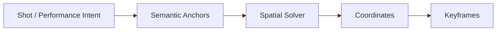

Anchor 始终保存，坐标是当前 Layout 下的解析结果。

---

# 22. Director 人工锁与 Undo

锁必须是服务端规则，不是 UI 灰按钮。修改 locked target 且无 explicit override authorization → reject。

拖动期间：pointer move→local transient state；pointer up→local command；显式保存/合理 debounce→Previz Revision。不要每 16ms 建 DB revision。

UI 本地 Undo/Redo 只处理未提交命令；已提交内容通过新 Previz revision 做 revert。

---

# 23. Seedance-style 同源 Control Compiler

核心原则：**白模、几何体检、Prompt Facts、Depth/Pose 必须来自同一 Previz Revision。**

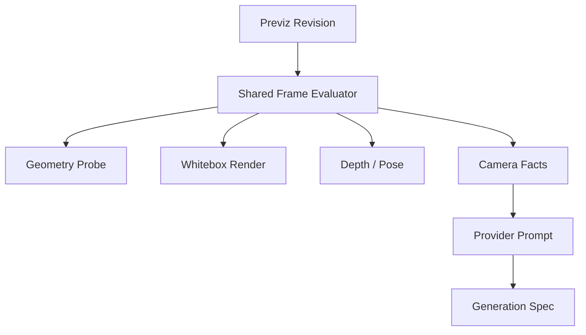

禁止白模一份轨迹、Prompt 另一份手写数字。


---

# 24. Generation Domain

## 24.1 独立于 AgentRun / Workflow ExecutionRun

媒体生成有完全不同的生命周期和失败语义，新增：

```text
backend/app/generation/
```

不要把视频/音乐/TTS 生成塞进 AgentRun，也不要强迫复用 Workflow ExecutionRun。

## 24.2 generation_jobs

```sql
id
project_id
job_kind
purpose_type
purpose_id
provider_id
provider_model
spec_json
spec_version
status
external_job_id NULL
created_at
started_at NULL
completed_at NULL
```

状态：

```text
queued
running
succeeded
failed
cancelled
interrupted
```

## 24.3 generation_attempts

同一 logical job 的每次尝试独立保留。失败重试不是覆盖 attempt1，而是产生 attempt2。

## 24.4 generation_outputs

```sql
id
job_id
attempt_id
media_asset_id
role
metadata_json
created_at
```

所有输出必须先注册 Media，再被 Timeline / Design / Review 使用。

## 24.5 Provider-neutral GenerationSpec

Domain 不保存 Seedance/Runway/ElevenLabs 等供应商专属字段。内部只保存：

```json
{
  "purpose": "shot_video",
  "duration": {"value": 96, "rate_num": 24, "rate_den": 1},
  "visual_refs": [],
  "control_refs": [],
  "camera_intent": {},
  "subject_intent": {},
  "audio_refs": [],
  "negative_constraints": []
}
```

Adapter 才负责：

```text
GenerationSpec → Provider API payload
```

替换供应商时 Domain 不变。

## 24.6 Motion Provider

Director 内部统一：

```text
MotionClip
SkeletonBinding
MotionConstraint
MotionKeyframe
```

外部：

```text
Template Motion
Kimodo Adapter
HY-Motion Adapter
Future Adapter
```

常规动作模板优先，特殊动作才调用模型。模型私有 NPZ/骨骼格式不能成为 Director Domain 的公共字段。

---

# 25. Generation 的持久恢复与成本边界

昂贵 Provider 调用不能因为服务重启就自动重发。

startup reconciliation：

```text
running jobs
↓
provider supports status query?
├─ yes, completed → reconcile output
├─ yes, still running → resume polling
├─ yes, failed → fail
└─ no/unknown → interrupted
```

`interrupted` 默认需要用户显式 retry，避免重复扣费。

每个 attempt 记录：provider/model、input hash、duration、token/credits（如可得）、cost estimate version、latency、external id。未知成本显示 unknown，不显示 0。

---

# 26. 媒体文件与数据库的事务边界

文件系统无法和 SQLite 真正 ACID。使用 prepare/finalize：

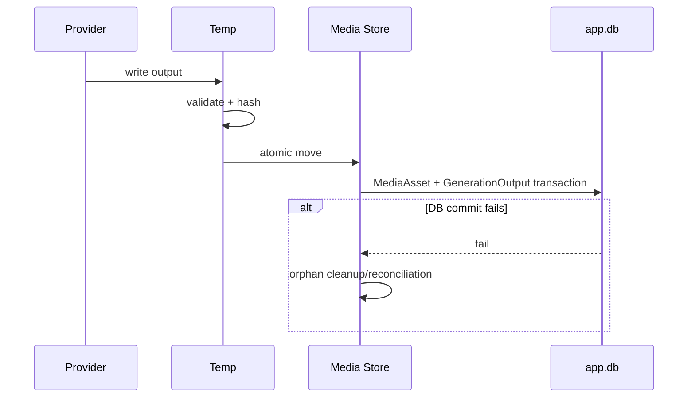

需要可重复的 orphan media reconciliation，但第一版不引入分布式事务框架。

---

# 27. Director Previz 与 Timeline 的边界

它们不是同一层：

```text
Director Previz：
“这一帧人物和摄影机在三维空间是什么状态？”

Master Timeline：
“这一段媒体在成片什么时候出现？”
```

Director `frame 57` 可以是 SH018 内部 local time；Timeline 是 EP01 global media time。二者由 stable shot/item binding 连接。

---

# 28. Story Time 与 Media Time

继续保留 `NarrativeTimepoint` 只表达故事时间；Timeline 表达观众观看时间。


闪前/闪回会导致：

```text
Media 00:00 → Story T2
Media 00:45 → Story T0
```

因此绝对不要给 `narrative_timepoints` 增加一个企图统一两者的 `frame_number`。

---

# 29. 全局数据血缘图

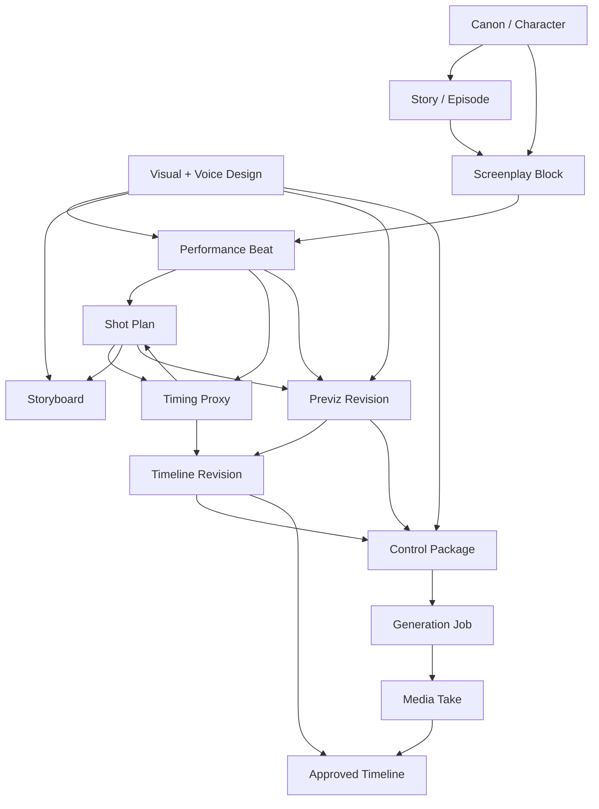

注意 `PROXY → SHOT` 表示正式的 Shot Timing Pass 产生 Shot 新 revision，不代表 Timing Proxy 直接跨域覆盖 Shot。

---

# 30. 状态流总览

## 30.1 上游修改

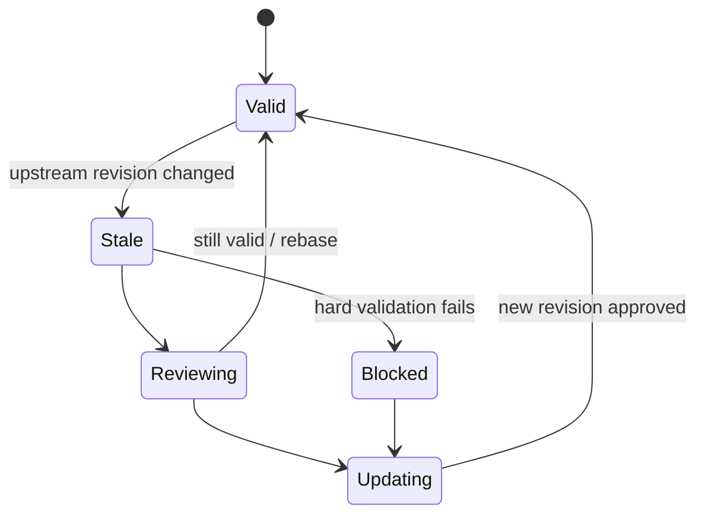

## 30.2 下游反馈

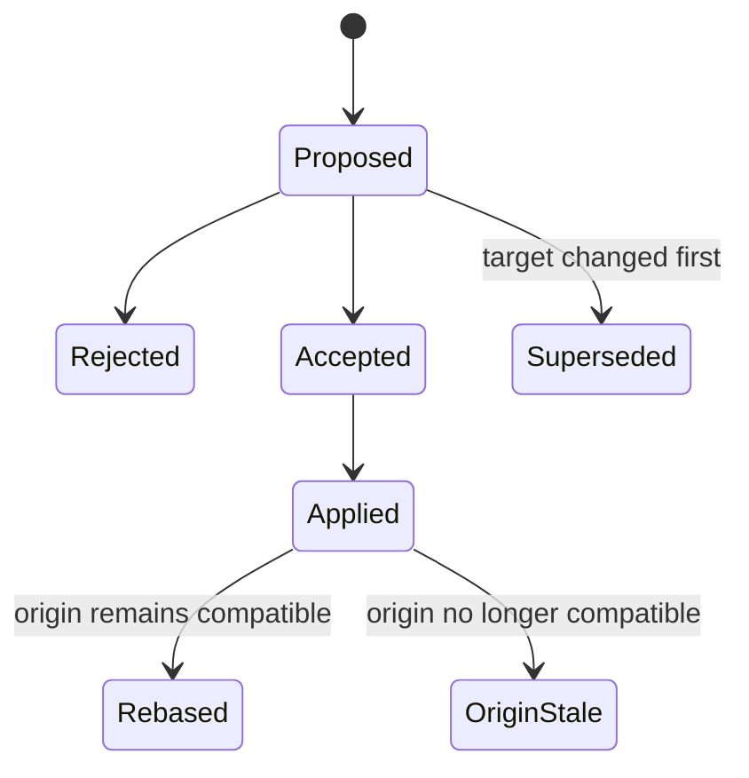

## 30.3 Generation

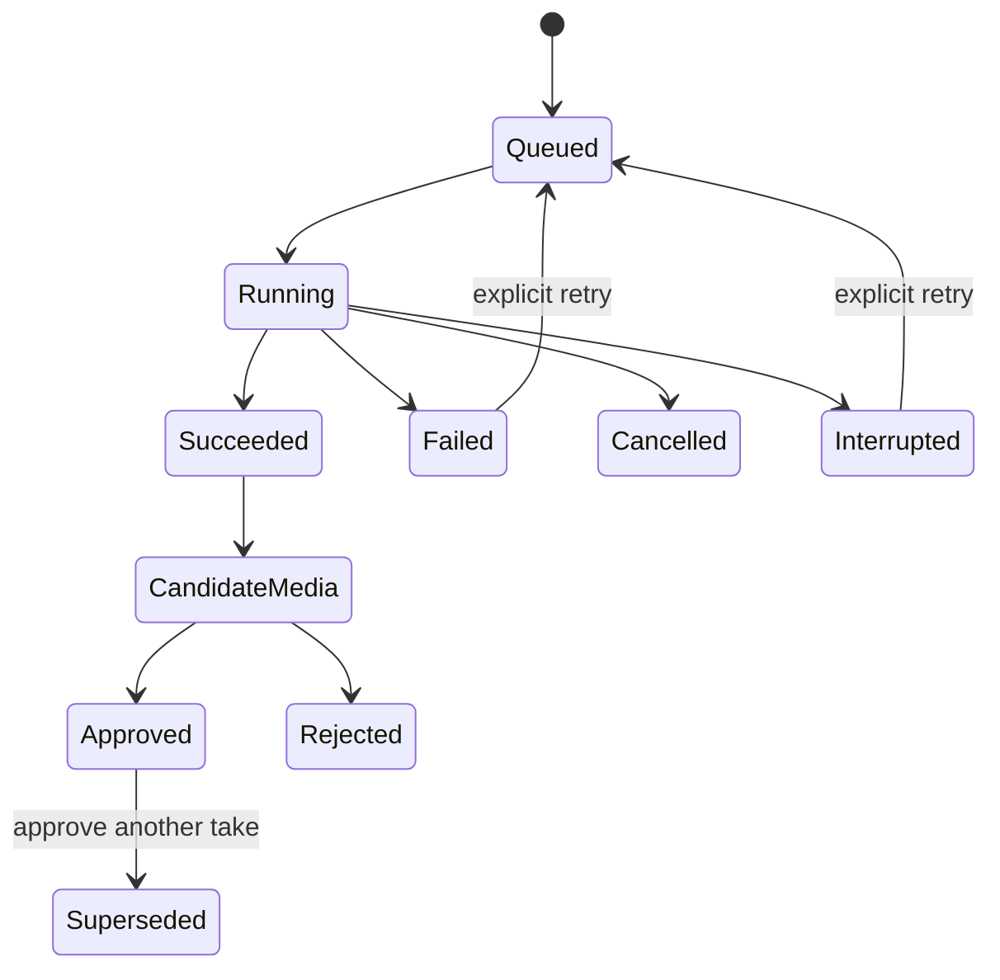

## 30.4 Timeline Lock

建议：

```text
open
→ timing_locked
→ picture_locked
→ final_locked
```

- `open`：镜头/对白时间可自由调整；
- `timing_locked`：主要对白与节奏稳定，改 duration 必须 impact preview；
- `picture_locked`：视频 cut 基本冻结，音频仍可 trim/replace；
- `final_locked`：任何改动都先 explicit unlock + impact preview。

---

# 31. Sound 数据分层

必须明确：

```text
Voice Profile ≠ Dialogue Performance ≠ Voice Audio
Music Style  ≠ Music Cue            ≠ Music Audio
```

Owner：

| 数据 | Owner |
|---|---|
| Voice Profile | Design |
| Dialogue Performance | Performance Script |
| Voice Audio | Media |
| Voice Placement | Timeline |
| Music Style | Design |
| Music Cue | Production/Timeline semantic |
| Music Audio | Media |
| Music Placement | Timeline |

全局 Sound Motif（如血契、愿力、承天阁、青苗苑）是 Design Artifact；Music/SFX Cue 引用 motif revision。

---

# 32. Context Compiler V4

Active Agent Plan G 完成后，production context 请求扩展到：

```json
{
  "project_id": "...",
  "series_id": "...",
  "episode_id": "...",
  "scene_id": "...",
  "beat_id": "...",
  "shot_id": "...",
  "artifact_id": "...",
  "block_ids": [],
  "narrative_timepoint_id": "...",
  "timeline_id": "...",
  "timeline_item_ids": [],
  "perspective": "author",
  "skill_id": "...",
  "budget": {}
}
```

Skill Contract 仍只声明 required/optional/denied；服务端 Context Compiler 根据 ID、Owner service、revision、permission、budget 组装。客户端不得把任意 context JSON 直接当权威。

---

# 33. 新 Atomic Skills 与 Tools

不要一次创建全部，随对应 Domain 落地逐个加入。

建议 Skill：

```text
design.visual_style.define
design.character_visual.define
design.location_layout.define
design.voice_profile.define
performance.dialogue_direct
shot.plan
shot.timing_budget
voice.timing_proxy_plan
music.cue_plan
director.blocking_plan
director.camera_plan
continuity.timeline_check
continuity.spatial_check
change.propose_upstream
```

以下是 Tool/Generation Adapter，不是 Skill：

```text
voice.synthesize
music.generate
video.generate
motion.generate
alignment.compute
media.probe
```

Skill 决定“创作意图”，Tool 执行确定动作。

---

# 34. Skill Commit Adapter 重构

当前 `skills.service` 用固定 `commit_action` if/elif。V4 建议在 Active G 收口后改为受控 registry：

```text
CommitAdapterRegistry
├─ none
├─ artifact.edit_block
├─ production.create_document
├─ change.create_proposal
├─ design.create_revision
├─ timeline.create_revision
└─ director.create_revision
```

每个 adapter：

- 明确所属 Domain；
- 接收已校验 payload；
- 只能调目标 service；
- 声明 transaction behavior；
- 有独立 schema；
- 不能调用“下一个 Skill”；
- 不能决定 workflow stage。

不是让 Skill 获得任意写表能力。

---

# 35. 数据存储目标

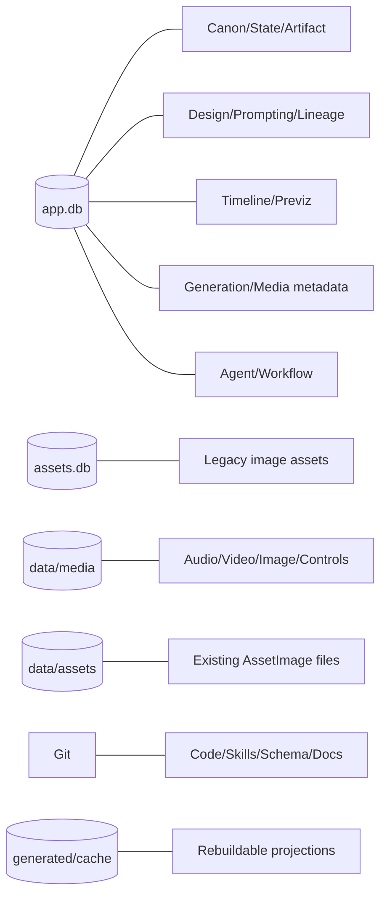

生产 Media metadata 进入 `app.db`，因为它与 Timeline/Lineage/Generation/Shot 强事务关联。现有 `assets.db` 第一阶段不搬，避免一次大迁移。

---

# 36. Derived Projection：哪些可以删掉重建

以下不得升级成第二事实源：

```text
HTML rendering
graph projection
latest Prompt HTML/View projection
prompt facts
scene.json export
OTIO export
thumbnails
waveform
proxy video
search index
dependency-graph markdown
```

它们都是由 owner data + revision 重新编译的 Projection。例外是：**已经被 Generation Job 实际使用的 exact Prompt Compilation snapshot 必须作为审计输入保留**，即使未来可以重新编译，也不能用“新编译结果”替换历史任务当时真正发送给 Provider 的输入。

---

# 37. ID 体系需要提前冻结

新增稳定 ID：

```text
design_id
visual_asset_work_item_id
prompt_spec_id
prompt_spec_revision_id
prompt_compilation_id
media_asset_id
media_variant_id
lineage_edge_id
change_proposal_id
timing_proxy_id
audio_alignment_id
timeline_id
timeline_track_id
timeline_item_id
timeline_revision_id
previz_sequence_id
previz_revision_id
generation_job_id
generation_attempt_id
generation_output_id
```

继续沿用 project/series/episode/scene/artifact/block/revision/beat/shot/event。

跨领域 Lineage 可以使用 polymorphic reference，因为“跨领域引用图”就是它的职责；这种通用 ref 不要扩散到所有 Domain 内部。

---

# 38. 前端产品设计总原则

前端 V4 的目标不是“把所有后端功能都做成按钮”。

核心心理模型：用户想知道：

```text
我现在在哪？
我正在做什么？
下一步是什么？
为什么这个动作不能做？
这次修改会影响什么？
我能不能撤回？
```

所以 UI 围绕：

```text
Scope
Current Task
Next Action
Impact
Recovery
```

组织，而不是围绕技术 Domain 组织。

---

# 39. 一级信息架构：保持少而稳定

推荐顶层只保留：

```text
概览
创作
剧集
资料
```

Agent 不再作为必须经过的一级目的地。当前 `AgentDock` 的非模态右侧协作形式继续保留，并成为默认 Agent 入口；完整 `/agent` 页面作为高级会话/记忆入口。

---

# 40. Project Shell

```text
┌──────────────────────────────────────────────────────────┐
│ Project / Series / Episode Scope       Search   Agent    │
├──────┬───────────────────────────────────────────────────┤
│      │                                                   │
│ Rail │                Current Workspace                  │
│      │                                                   │
│      │                                                   │
├──────┴───────────────────────────────────────────────────┤
│ Contextual Bottom Tray（需要时间轴时才出现）             │
└──────────────────────────────────────────────────────────┘
```

左 Rail 默认窄，不常驻展示十几阶段。点击/hover 才展开一级分组。

---

# 41. Scope Bar

顶部始终让用户知道当前层级，但只显示到当前有效 scope：

```text
希声 / 世界
希声 / 行歌 / EP01 / 剧本 / SC05
希声 / 行歌 / EP01 / SC05 / SH018
```

Scope 是导航事实，不是装饰。

---

# 42. Project Overview：默认落点不再是 Graph

`/projects/:projectId` 应默认重定向到 `overview`。

Overview 只回答：当前进度、下一步、阻断、stale/review 数量、最近变化。

示例：

```text
《希声》

当前系列：行歌
EP01：分镜准备中

下一步
[完成 SH018–SH026 文字分镜]

需要注意
2 个上游修改待复核
1 个声音设计未批准

最近
陈知澜 Voice Profile v3 已批准
EP01 剧本 v0.3 已更新
```

不要把所有实体、所有 Skill、所有 Gate 铺在首页。

---

# 43. 创作区按创作者语言组织

`创作` 内部：

```text
世界
人物
视觉
声音
故事
```

不是：

```text
entities
relations
claims
artifacts
```

现有 Graph 移到 `资料 / 世界图谱`，保留其高级价值但不再定义主流程。

---

# 43.1 视觉资产工作区：进度驱动，而不是“文档文件夹”

`创作 / 视觉` 下新增 Visual Asset Workspace。用户首先看到资产列表/卡片，而不是合同、Prompt、图片三类文档各自散落：

```text
陈知澜·基础人物    合同✓  Prompt✓  出图 3 个候选  待批准
陈知澜·晨练服      合同✓  Prompt待复核          未出图
修习场             合同草案                     阻塞：缺尺寸
软柱               已批准                       可复用
```

点击一个资产后进入单资产页：

```text
概览 | 合同 | 提示词 | 图片 | 历史
```

`提示词`页默认只展开“实体视觉内容”，其余 Style / Output / Camera / Render / Effects / Negative 层折叠。用户修改某层字段后：

```text
structured edit
→ validation
→ recompile preview
→ diff
→ user confirm
→ new Prompt Spec revision
```

页面顶部生产进度完全读取 Workflow state，不从 Prompt 文本解析“完成/阻塞/已出图”。编译后 Prompt 可展开查看，但默认不是主编辑面；用户主要编辑分层结构。

人物三视图、面部近景、表情、细节等在 UI 上显示为同一个 Sheet Layout 的 panel 预览，不默认显示成多个独立生成任务。

---

# 44. 剧集区与 Episode Workspace

剧集首页先显示 Episode Board：

```text
EP01  剧本已批 / 分镜中
EP02  已规划
EP03  草案
```

进入 EP01 后，不要在顶部永远排一长串 Tab。使用 compact Production Rail：默认只显示“上一步 / 当前 / 下一步”；点击“展开全流程”才显示：

```text
剧本
制作分解
演出台本
镜头规划
Timing
分镜
导演预演
声音
时间线
生成
审片
```

---

# 45. 中央视口优先

主工作区尽量保留 70–100% 宽度。Inspector、History、Impact、Agent、Context 都应是可收起 Drawer。

禁止默认布局：

```text
左300 + 右400 + 底300 → 中间只剩小窗
```

Inspector 只有选中对象时才打开；无选择自动收起。

---

# 46. Impact Drawer 与 Review Center

上游变化后页面只显示轻提示：

```text
⚠ 3 个下游需要复核
```

点击打开右 Drawer：

```text
Script B42 rev7
├─ PB12 stale
├─ SH18 review
└─ PV18 compatibility checking
```

所有 stale、blocked、continuity finding、generation failure、memory conflict、change proposal 汇总到 Review Center；普通页面不铺满红色警告。

---

# 47. Block Editor 的原子化交互

剧本/台本 block hover 时才出现 `✨` 与 `⋯`。点击 `✨` 弹出当前 block 可执行的 Atomic Skill：

```text
对白更自然
压缩
增强潜台词
调整动作
自定义指令
```

流程：

```text
select block
→ skill candidate
→ inline diff
→ impact preview
→ accept/reject
```

用户不必为了改一句话先打开完整 Agent 聊天。

---

# 48. Agent Dock 新定位

保留当前 `Ctrl/Cmd+J` 和右侧非模态 Dock，这是现有设计中应继续沿用的优秀模式。

新增 Context Chips：

```text
EP01 / SC05 / B42 / 陈知澜 / author
```

- required context 显示锁图标；
- optional context 可用户移除；
- 可 `+ @引用`；
- Agent 输出涉及写入时仍走 Candidate/Confirm。

完整 Agent Home 中 Sessions 常驻即可；Memory Docs / Project Memories 建议移动到折叠的 “Memory & Context” 或设置页，避免左栏越来越拥挤。

---

# 49. Context Disclosure

现有 SessionView 已有“本轮上下文来源”能力，继续保留但默认折叠。展开用人类术语：

```text
自动读取：
- 当前场 SC05
- 选中块 B42
- 陈知澜 Voice Profile
- Scene Entry Snapshot

明确未读取：
- 后续集剧情
```

普通用户不需要看内部 JSON；高级详情另开。

---

# 50. Timeline UI 渐进披露

Timeline 只在 Timing / Director / Sound / Timeline / Generation Review 工作区显示 Bottom Tray；其他页面不占底部空间。

默认 Essential View：

```text
Video
Dialogue
Music
```

Advanced 展开：

```text
Camera
Performance
SFX
State
Review
Generation
```

视觉约定：Timing Proxy 斜纹/半透明；Final Voice 实色；stale 只用琥珀色细边，不整块红色。

---

# 51. Director Stage UX

```text
┌──── Shots ────┬──────── 3D Stage ────────┬─ Inspector ─┐
│ SH017         │                           │ Camera      │
│ SH018 ●       │         viewport          │ Motion      │
│ SH019         │                           │ Locks       │
└───────────────┴───────────────────────────┴─────────────┘
┌──────────────── Director Timeline ───────────────────────┐
```

默认 toolbar 只显示：Select / Move / Rotate / Camera / Lock / Play。Anchor、Path Handle、Joint Fine Tune、Probe、Control Export 放进 contextual inspector / Advanced menu。

Agent 修改三维动作时先生成 ghost candidate path：虚线 candidate、实线 committed、锁图标 human lock；用户确认后才写 Previz revision。

---

# 52. 推荐前端路由

```text
/projects/:pid/overview

/projects/:pid/create/world
/projects/:pid/create/characters
/projects/:pid/create/visual
/projects/:pid/create/visual/assets
/projects/:pid/create/visual/assets/:designId
/projects/:pid/create/sound
/projects/:pid/create/story

/projects/:pid/series/:sid/overview
/projects/:pid/series/:sid/episodes

/projects/:pid/series/:sid/episodes/:eid/overview
/projects/:pid/series/:sid/episodes/:eid/script
/projects/:pid/series/:sid/episodes/:eid/production
/projects/:pid/series/:sid/episodes/:eid/shots
/projects/:pid/series/:sid/episodes/:eid/storyboard
/projects/:pid/series/:sid/episodes/:eid/director
/projects/:pid/series/:sid/episodes/:eid/sound
/projects/:pid/series/:sid/episodes/:eid/timeline
/projects/:pid/series/:sid/episodes/:eid/review

/projects/:pid/resources/graph
/projects/:pid/resources/assets
/projects/:pid/agent
```

旧 `/graph`、`/assets` 保留 redirect，避免破坏深链和既有测试/用户习惯。

---

# 53. 前端状态所有权

URL 保存可分享/刷新恢复状态：project、series、episode、scene、shot、workspace。

Zustand/local UI 保存：panel open、selection、timeline zoom、director transform mode、未提交 local draft。

Backend 保存：approved content、revision、lock、timeline、previz、media、generation job。

不要把 canonical production data 放在 Zustand 里当真相。

建议新增 store 不做单一巨型 `productionStore`：

```text
scopeStore
workflowStore
artifactEditorStore
timelineStore
directorStore
reviewStore
mediaStore
generationStore
```

高频 playhead / 3D frame state 用 imperative ref 或专用轻量状态，不让整页重渲。

---

# 54. Gate 的前端心理设计

未来阶段可浏览，执行被 Gate 阻止时必须解释缺什么：

```text
[生成 Storyboard] disabled

还缺：
✓ 剧本已批准
✓ 制作分解完成
○ 演出台本未批准

[去完成演出台本]
```

避免只给“不可用”。

---

# 55. 新项目用户动线

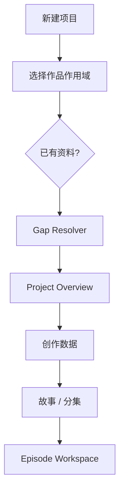

作品作用域：单篇作品 / 单一系列 / 共享世界。它影响数据 scope，不要求用户理解数据库。

---

# 56. Episode 用户动线

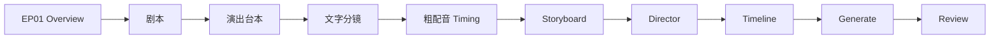

Production Breakdown 对普通用户更像“本集准备清单”，可以放在 Overview/Production 子页，而不是强迫所有人把它当大型主工作区频繁切换。

---

# 57. Contextual Asset Picker

用户在 Storyboard 里选择“陈知澜当前服装”时，不应离开编辑器跳到资产管理再返回。当前页面弹 Asset Picker Drawer，根据：

```text
character_ref
scene timepoint
design kind
```

推荐当前有效设计 revision 和已批准 media reference。

---

# 58. 前端错误与提示语义

继续沿用当前“三要素”：发生了什么 / 为什么 / 怎么修，并增加“影响范围”。

状态区分：

```text
Info
Needs Review
Blocked
Conflict
Failed
```

stale 通常是 Needs Review，不应把整个应用涂红。

---

# 59. Revision / Rollback UI

Revision History Drawer：

```text
rev12 current
rev11
rev10
rev9
```

点击 rev9 的动作必须叫：

```text
[用此版本内容创建新 revision]
```

不是“把 rev9 设为 current”。确认后生成 rev13=revert(rev9)。

Narrative State Ledger 的“纠正”创建 compensation event，而不是编辑旧 event。

---

# 60. Change Impact 的用户体验

用户编辑 B42 后按保存。如果没有 dependents，直接建 revision；有下游时显示：

```text
这个修改将影响：
2 个 Performance Beats
3 个 Shots
1 个 Director Previz
1 段已生成视频

不会自动删除或重新生成。

[查看详情] [仍然保存] [取消]
```

不要每打一行字都弹，只有提交 revision 时评估。

---

# 61. Stale Review 体验

进入 SH018：

```text
来源剧本已更新 · 1 项
[查看差异]
```

Drawer：

```text
旧：“落地后立刻冲向侧门”
新：“落地脚下一晃，仍急着转向侧门”

[这个 Shot 仍然有效]
[更新 Shot]
[稍后处理]
```

“仍然有效”必须写入 review/rebase audit，不只是前端把黄色隐藏。

---

# 62. 运行对象不要混成一个 Run

继续明确：

```text
AgentRun              聊天轮
Workflow ExecutionRun 创作 Skill 运行
GenerationJob         媒体 Provider 任务
```

三者语义不同，不能为“统一”强行合并。

Execution Trace 展示可验证事实：读取哪些 source、执行哪个 skill/tool、哪些 validator 通过、candidate/impact、provider usage；不展示原始 CoT。


---

# 63. 数据同步的长期原则

“同步”不等于复制正文。

应采用：

```text
Owner Data
+
Stable Ref
+
Revision Baseline
+
Derived Projection
```

例如 Storyboard 不复制一整份人物设定，而是保存：

```text
character_id
character_visual_revision
costume_revision
narrative_state_snapshot_ref
```

需要展示/生成时由 Context Compiler/Owner Service 展开。

---

# 64. 事务边界

所有只涉及 `app.db` 的 candidate accept、artifact revision、lineage update、timeline revision、change proposal decision，应尽可能在一个 outer transaction 中完成。

延续 Agent C 阶段已经采用的 `commit=False` 参与式 service/UoW 思路：领域 service 可以独立使用，也能由更外层 application service 组成原子事务；禁止跨域直接 import repository 绕过 service。

---

# 65. Project Isolation / Security

新增所有主表必须有 `project_id` 或能通过强 FK 推导 project，并在 service 层做 ownership validation。

通用 `source_ref`/lineage ref 不能仅凭字符串 ID 信任。

Provider 安全：

- secrets 只在 env/config；
- log 不输出凭据；
- provider output 当不可信输入；
- MIME / size / hash 校验；
- 用户 filename 不参与物理路径；
- media path containment；
- project/perspective 不能由模型参数越权改写。

---

# 66. 性能原则

## Timeline

一集可能数百 items。playhead 每帧只更新 imperative overlay / playback state，不能触发整条轨道 React 重渲。必要时对轨道列表做虚拟化，但不要第一版先引入复杂 Canvas timeline framework。

## Director

```text
FrameState → direct Three object transforms
```

不要：

```text
frame → giant Zustand state → whole React tree
```

## Media

大视频默认 thumbnail/proxy；原始文件按需加载。waveform 是可重建 projection。

---

# 67. OpenTimelineIO Adapter

后续可以实现：

```text
Timeline Domain ↔ OTIO Adapter
```

用途：专业 NLE 数据交换、debug、导出。OTIO 文件仍是 projection，不是内部数据库真相。

---

# 68. Migration Strategy

## 68.1 不做大爆炸

每个阶段遵循：

```text
schema
→ migration test
→ domain service
→ API
→ frontend
→ acceptance
```

且独立授权、独立 ExecPlan。

## 68.2 ArtifactDependency → Lineage

建议：

1. 新建 `lineage_edges`；
2. 把现有 artifact dependency 映射进去；
3. 做双读一致性测试（短期）；
4. Artifact stale evaluator 切到 Lineage；
5. 停止旧表新写入；
6. 清理旧代码；
7. 证据充分后才 drop 旧表。

不要长期双写。

## 68.3 Artifact status 迁移

现有 `draft/stale` 迁移为：

```text
approval_status
+
freshness projection
```

必须保留 current revision 和 stale cause，不丢历史。

## 68.4 Timeline Production Document 迁移

旧 timeline block：

```text
track_type / source_ref / start / duration
```

Importer 转为：

```text
Timeline / Track / Clip / placement_range
```

旧 Artifact 可记录 migrated timeline id，但不删除历史 revision。

## 68.5 Existing assets.db

V4 初期不搬库。只新增 production Media Registry，必要时通过 LegacyAssetBridge 引用旧图片。等真实生产使用证明统一必要，再单独做资产迁移 initiative。

## 68.6 Episode / Scene Plan 版本化

当前 Episode outline / ScenePlan 行是 Workflow Core 结构数据，不要在 V4-R2 顺手大改。等 Story/Planning UI 真正需要“outline block-local stale”时，单独做 Planning Artifact Binding：Workflow 持 hierarchy identity，Artifact 持可修订正文/semantic。避免一次迁移所有字段。

---

# 69. V4 实施阶段

每个阶段必须单独获得用户授权；完成后停止，不自动进入下一阶段。

## V4-R0 — Baseline Reconciliation（只读为主）

确认：

```text
git status
HEAD
migration head
active ExecPlans
feature state
API/schema
frontend routes
Active Agent G/H 状态
```

特别检查 active Agent plan 中“未提交”等描述是否已被 Git 新提交改变。Repository 是事实源；发现差异就更新 plan 事实，不按旧叙事猜。

不改业务行为，不跑历史全量 benchmark/mutation。

## V4-R1 — Frontend Product Shell

后端 R4–R6 已有但没有主 UI，因此可以较早做：

```text
/projects/:pid/overview
Scope Bar
新的一级 IA
Series/Episode navigation shell
Production Rail shell
```

保留 Graph/Assets/Agent 旧能力和 redirect。不实现 Director/Timeline 细节。

验收：用户进入项目能看见“当前阶段/下一动作/阻断”，默认不再掉进 Graph；旧深链仍可工作。

## V4-R2 — Lifecycle + Lineage + Change Proposal

状态：2026-09-19 已完成 R2 后端/API 阶段。执行与验收记录：`docs/exec-plans/completed/v4-r2-lineage.md`；报告：`docs/reports/v4-r2-lineage-2026-09-19.md`。停在 R3 边界。

实现：

- approval/freshness 分离；
- Lineage Core；
- invalidation policies；
- Impact API；
- Change Proposal；
- Rebase；
- Artifact revert revision；
- Review audit。

本阶段不接媒体 Provider。

## V4-R3 — Visual Asset Production Platform（Design + Prompting + Media）

这一阶段先把**系统接口和数据地址搭好**，不批量改现有 Skill。为避免一次改动过大，实际 ExecPlan 应至少拆成可独立验收的 A/B/C 小切片，但仍属于同一个 V4-R3 产品阶段。

### R3-A — Creative Design + Asset Manifest

实现：

- design bindings / stable design id；
- character/costume/prop/document_prop/location 等合同类别；
- Visual Asset Manifest Artifact + block-local source refs；
- 单资产 work item / workflow subject identity；
- contract approval 与 lineage。

### R3-B — Prompting Core + Compiler + HTML Workspace

实现：

- `backend/app/prompting/`；
- repository-owned Prompt Blueprints / Sheet Layout / Camera / Render Presets；
- `prompt_specs` / immutable `prompt_spec_revisions`；
- 七层 Prompt AST：style/output_format/camera/render/effects/entities/negative；
- deterministic Prompt Compiler；
- `prompt_compilations` exact snapshot；
- Prompt validation findings；
- Workflow-owned prompt production stages；
- Visual Asset HTML workspace：合同/提示词/图片/历史；
- Prompt 页面默认展开 entities 层，其余层折叠；
- multi-panel Sheet 作为一次生成规格，而不是默认拆成多个生成任务。

### R3-C — Media Registry / Visual Asset Media Bridge

实现：

- media metadata；
- `data/media` store；
- media variants / take approval；
- generated sheet image 与 design/prompt lineage；
- legacy asset bridge。

本阶段可以使用手工上传/fake image output 验证闭环，不接真实图像 Provider；真实 Provider 仍属于 V4-R8 Generation Domain。

**明确不属于 R3 完成条件：**批量重写现有 Skill。旧聊天型 Skill 仅作为字段/创作规则参考；等 Prompting/Design/Workflow 接口稳定后，再按单独的《Skill 修订要求》批量迁移。

## V4-R4 — Timeline Core

实现：

- RationalTime；
- Tracks；
- Clip/Gap/Transition/Marker；
- source_range / placement_range；
- Timeline revision；
- narrative bindings；
- lock levels；
- old production timeline importer。

先用 placeholder clips。

## V4-R5 — Rough Voice / Timing

实现：

- TimingProxy；
- fake/pluggable TTS adapter；
- audio alignment；
- Shot Timing Budget；
- Timing Proxy clip；
- timing conflict；
- final voice replace contract。

不要求一开始接最优 TTS Provider。

## V4-R6 — Director Core / Previz

实现：

- `packages/director-core`；
- scene schema；
- spatial anchors；
- deterministic frame evaluator；
- camera/motion keyframes；
- human locks；
- probe；
- minimal Three.js Stage；
- Previz revision / local undo / revert。

不要先做复杂骨骼 AI、物理引擎、Blender 集成。

## V4-R7 — Control Compiler

实现：

```text
Previz + Design + Timeline
→ provider-neutral GenerationSpec
```

先完成 camera facts、shot timing、prompt facts、geometry validation。Depth/Pose 按真实 Provider 需求再加。

## V4-R8 — Generation Domain

实现 GenerationJob、attempt/output、fake provider、Adapter Registry、cancel/recovery、output→Media、usage/cost。只选择一个真实 Provider 做 vertical slice，不能一次接十个平台。

## V4-R9 — Integrated Episode Workspace

把已有和新增能力串成用户动线：

```text
Screenplay
→ Performance
→ Shot
→ Timing
→ Storyboard
→ Director
→ Timeline
→ Generate
→ Review
```

加入 Contextual Asset Picker、Impact Drawer、Review Center、Gate navigation。

## V4-R10 — 《希声·行歌》EP01 Vertical Slice

禁止只用 toy demo。真实跑“陈知澜晨练 / 撞软柱”片段，至少覆盖：

```text
Character / Narrative State
Screenplay block
Performance Beat
Shot Plan
Rough Voice
Shot timing
Storyboard placeholder
Location anchors
Director Previz
Timeline
Music Cue placeholder
Fake/real one-shot generation
Approved Media
Upstream edit
Localized stale
Reverse Change Proposal
Rebase
Rollback
```

这一阶段才算证明系统真的能完成“拍片链路”。

---

# 70. 阶段依赖图

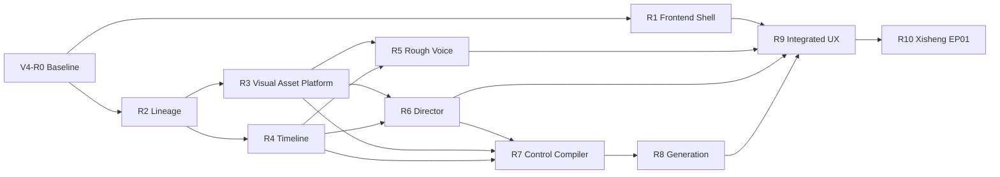

R1 可以与 R2 之后的后端地基部分并行，但不要在前端造假 API；未实现能力用清晰 blocked/placeholder 状态。

---

# 71. 与 Active Agent Plan G/H 的依赖

G 应优先收口：

```text
server-loaded authoritative context
server-calculated gates
strong schema validators
protected-span verification
chat → bounded skill adapter
```

V4 后续 production Skill 复用它，不再造第二套 Context/Gate。H 的检索/成本优化不是 Timeline/Director 的硬前置，可以独立推进。

---

# 72. Architecture Docs 的最终 Owner

每个 V4 阶段完成后，把 durable truth 提炼到 bounded docs，而不是长期依赖本 master plan：

```text
docs/design-docs/
  lineage-and-change-management.md
  creative-design-and-media.md
  visual-prompting-and-asset-production.md
  timeline-core.md
  director-previz.md
  generation-pipeline.md
  frontend-production-workspace.md
```

产品行为：

```text
docs/product-specs/
  production-workspace.md
  visual-asset-workspace.md
  timeline-editing.md
  director-workspace.md
  media-generation.md
```

根 `ARCHITECTURE.md` 只更新短 ownership/dependency map。

---

# 73. Machine Enforcement

能够机器强制的规则不要只写文档：

- DB FK / unique / check；
- Pydantic / JSON Schema；
- import-linter；
- TypeScript type；
- Timeline range validator；
- Previz schema validator；
- Lineage project ownership；
- locked-field validator；
- media path/hash validator；
- migration tests；
- contract tests。

文档解释 why / ownership；代码负责 enforcement。

---

# 74. 测试与验收矩阵

## 74.1 Lineage

必须证明：

```text
修改 B42
→ 只 stale 依赖 B42 old revision 的节点
```

以及：

```text
Change Proposal accept
→ target new revision
→ origin compatibility validator pass
→ rebase
```

不相关下游保持 valid。

## 74.2 Rollback

Artifact：

```text
rev3 → rev4 → revert rev2 = rev5
```

rev3/rev4 仍可读。

State：

```text
event1
event2
compensation(event2)
```

current 正确且 history 完整。

Timeline/Previz 同理。

## 74.3 Timeline

覆盖：

- exact frame math；
- 24/30/48000 rate conversion；
- source_range；
- placement_range；
- Gap；
- Transition；
- negative range reject；
- overlap policy；
- lock；
- source stale；
- final voice swap 不改变 placement；
- trim 正确；
- narrative binding。

## 74.4 Rough Voice

Fake TTS 返回可预测 waveform metadata，验证：

```text
dialogue
→ proxy
→ alignment
→ timing budget
→ timeline placeholder
```

默认不调用真实计费模型做回归测试。

## 74.5 Director Core

Golden test：

```text
same scene_json + same time
→ exactly same FrameState
```

覆盖 interpolation、anchor resolution、camera、motion、locks、path、prompt facts、geometry probe。Renderer 测 adapter，不复制 Core 数学。

## 74.6 Generation

Fake provider 覆盖 success/fail/timeout/cancel/interrupted/duplicate/output registration/orphan cleanup。真实 Provider 只做极小 smoke test，明确预算。

## 74.7 Prompting / Visual Asset Production

必须覆盖：

```text
Visual Asset Manifest block
→ Design Contract revision
→ Prompt Spec revision
→ deterministic compilation
→ exact compilation snapshot
→ fake Generation input
→ Media Variant
```

并验证：

- 同一 Prompt Spec + 同一 Blueprint/Presets/Source revisions 编译结果稳定；
- Workflow status 不出现在 Prompt AST；
- “缺失关键参数”进入 validation finding / gate reason，不混入 compiled prompt；
- Contract / Visual Style 上游 revision 改变后 Prompt Spec/Compilation 按 lineage 进入正确 stale/recompile 状态；
- 人物 standard sheet 的三视图、近景、表情、细节作为**同一 output sheet** 的 panels；
- 用户编辑 entity layer 后只创建新 Prompt Spec revision，不静默修改 Contract；
- compiled prompt exact snapshot 与 Generation Job 输入一致；
- HTML 页面不通过解析 Markdown/自由 HTML 重建 Prompt AST。

## 74.8 Frontend E2E

关键 journey：

```text
打开 EP01
→ 编辑一个 Script Block
→ impact preview
→ accept revision
→ Shot stale
→ review
→ still valid / update
→ Visual Asset Manifest
→ 打开一个资产合同
→ Prompt Spec 编译
→ fake asset sheet candidate
→ Shot Plan v0
→ Rough Voice
→ timing budget
→ Storyboard
→ Director
→ Timeline
→ fake generation
→ approve take
```

同时验证刷新、返回、深链、项目切换、Drawer 状态不会污染其他项目。

---

# 75. Observability

继续使用现有 observability 体系，但新增结构化事件：

```text
lineage_stale_marked
change_proposal_created/accepted/rejected
artifact_reverted
timeline_revision_created
prompt_spec_revision_created
prompt_compiled
prompt_validation_failed
visual_asset_workflow_stage_changed
timing_conflict
director_lock_violation
generation_started/completed/failed/interrupted
media_registered/media_missing
```

日志只记录 IDs / metadata / timing / provider usage，不默认记录剧本文本、音频内容或 provider secret。

---

# 76. 前端可观测但不暴露 CoT

用户可以看到：

```text
读取：SC05 / B42 / Voice Profile v3
执行：shot.timing_budget
校验：schema PASS / continuity PASS / timing PASS
候选：SH018 revision
影响：3 downstream
```

不把 provider reasoning 当工作流真相。

---

# 77. 不要做的事

1. 不把所有新能力继续塞进 `production.service.py`。
2. 不把 Timeline 永远维持成普通 JSON block。
3. 不把 Rough Voice 当最终 Voice 直接锁死。
4. 不让白模与 Prompt 各维护一份轨迹。
5. 不给每个 Provider 建一个 Domain。
6. 不让生成图/视频反向成为设计事实。
7. 不允许下游静默修改上游。
8. 不因 stale 删除下游。
9. 不因 stale 自动重新生成收费媒体。
10. 不通过删除 revision 实现 rollback。
11. 不让 Agent Memory 成为第二 Canon。
12. 不把所有 production stage 继续做成一根 `DOCUMENT_ORDER`。
13. 不把十几个 production stage 永久铺在顶部导航。
14. 不让 Three.js playhead 每帧引起整页 React render。
15. 不在同一阶段同时大迁移 assets.db、Timeline、Director 和前端。
16. 不为了“架构标准”提前拆微服务。
17. 不在没有证据前引入 Kafka/Celery/Redis/向量数据库。
18. 不让 OTIO 文件成为数据库真相。
19. 不允许 AI silent override 人工 lock。
20. 不让 Codex 一次性执行 V4-R0～R10。
21. 不把“状态、缺失关键数据、待确认建议”继续塞进最终生图 Prompt。
22. 不从 Markdown / 人类聊天式 HTML 反向解析 Prompt AST 作为正式生产路径。
23. 不让每个视觉 Skill 自己重复维护全局风格、相机、版式和渲染模板；这些进入 Blueprint/Preset/Compiler。
24. 不默认把三视图、面部近景、表情、细节拆成多个生成任务；它们首先是同一 Sheet 的 panels。
25. 不在 Prompting 系统稳定前批量重写现有 Skill；先搭系统接口，再用独立 Skill 修订要求统一迁移。
26. 不因为 V4 存在而跳过当前 Active Agent ExecPlan 的真实状态核对。
27. 不为了目录美观重新拆已经稳定的 Agent flat-module implementation；只有职责问题才改。

---

# 78. Definition of Done：最终产品判断

V4 成功不是“多了 Three.js 页面”，而是用户可以完成：

```text
我从台本/剧本得到本集视觉资产清单
↓
每个资产拥有正式合同和稳定 Design ID
↓
系统按 Blueprint + 全局视觉风格 + 资产合同编译结构化 Prompt
↓
我在 HTML 资产页默认只编辑实体视觉层，需要时展开其他层
↓
三视图/近景/表情/细节作为同一资产 Sheet 一次生成
↓
生成候选图与当时 exact Prompt Compilation 可追溯
↓
我修改剧本一句话
↓
看到它影响哪些分镜/资产/Prompt
↓
选择更新一个 Shot
↓
粗配音提前告诉我这个镜头大约需要 3.8 秒
↓
我在 Director 里用自然语言调整人物走位
↓
我手动锁住一个机位
↓
Agent 不会覆盖它
↓
白模、Prompt、Control 来自同一 Previz Revision
↓
正式配音替换粗配音后 Timeline 位置保持稳定
↓
音乐、音效、对白和镜头可以落到同一精确时间坐标
↓
模型生成 4 个视频 take
↓
我批准其中一个
↓
Master Timeline 使用它
↓
后来发现剧本有问题
↓
下游只提出 Change Proposal
↓
我批准后系统只把真正相关内容标 stale
↓
我可以 rebase、更新或 revert
↓
任何旧工作都不会神秘消失
```

这才是“可控、可追溯、可回滚、Provider 可替换”的 AI 影视生产工作台。

---

# 79. 外部架构参考（参考模式，不是项目事实源）

## OpenTimelineIO

`AcademySoftwareFoundation/OpenTimelineIO`

吸收：Timeline/Stack/Track、Clip/Gap/Transition、RationalTime/TimeRange、source range、range in parent、external media reference。

不吸收：用 OTIO 代替 Narrative State；用 OTIO 文件代替内部数据库。

## Kunpeng Director

`pengfeiqiao/kunpeng-director`

吸收：serializable Director Core、stable IDs、human locks、Agent/UI 共用 command service、frame evaluator、camera/motion keyframes。

改进：本项目内部时间不用长期 float seconds；director JSON 不升格为全项目真相。

## Seedance Skill

`alchaincyf/seedance-skill`

最关键参考：同一结构化 scene source 驱动 solver/preview/probe/prompt facts。

本项目中 `Previz Revision` 是上游真相，scene.json 是可重建导出 Projection。

## NVIDIA Kimodo / HY-Motion

作为 Motion Provider 参考。吸收 motion constraints、skeleton binding、adapter 边界；模型私有格式不能污染 Director Domain。

---

# 80. Codex 启动 V4 的建议第一条任务

当用户明确说“开始 V4-R0”时：

```text
1. 只读当前 HEAD / git status / migrations / active ExecPlans。
2. 对照本文当前事实，输出：
   - still true
   - already changed
   - conflicts
   - migration facts
3. 检查 Active Agent Plan G/H 的真实状态。
4. 不实现 V4-R1。
5. 不重新跑历史全量测试/mutation/benchmark。
6. 给出 V4-R1 与 V4-R2 的最小边界建议。
7. 停止，等待用户授权。
```

当用户说“开始 V4-R1”，创建独立 ExecPlan，只处理 Frontend Product Shell；说“开始 V4-R2”，只处理 Lifecycle/Lineage/Change Proposal。每个阶段完成后停止。

---

# 81. 最终系统心智模型

```text
CANON
告诉系统“这个世界是什么”

NARRATIVE STATE
告诉系统“故事这一刻是什么状态”

ARTIFACT
告诉系统“创作者写了什么”

DESIGN
告诉系统“它应该长什么样 / 听起来怎样”

PROMPTING
把已确认的视觉设计事实 + Blueprint/Presets 编译成可审查、可复现的模型输入；不拥有设计事实，也不拥有工作流状态

PRODUCTION
告诉系统“这一场 / 一镜要怎么演怎么拍”

DIRECTOR PREVIZ
告诉系统“空间与摄影机逐帧怎样运动”

TIMELINE
告诉系统“所有媒体什么时候出现”

MEDIA
保存“实际生成了哪些文件”

GENERATION
记录“这些文件怎么被模型生产出来”

LINEAGE
告诉系统“它为什么依赖这些上游”

CHANGE PROPOSAL
让下游可以安全地要求上游修改

AGENT
帮助用户完成一个明确动作，但不拥有上述任何领域真相
```

---

# 82. 当前仓库重点代码映射（供 Codex 快速定位）

本文撰写时已经重点核对：

```text
AGENTS.md
ARCHITECTURE.md
feature_list.json
docs/PLANS.md

docs/design-docs/artifact-core.md
docs/design-docs/narrative-state-core.md
docs/design-docs/workflow-core.md
docs/design-docs/production-documents.md
docs/design-docs/atomic-skills.md
docs/design-docs/agent-system.md
docs/design-docs/projects-assets-and-workspace.md

docs/product-specs/creative-workflow.md
docs/product-specs/production-documents.md
docs/product-specs/atomic-skills.md
docs/product-specs/agent-assistance.md

docs/exec-plans/active/agent-reliability-and-memory.md

backend/app/artifacts/models.py
backend/app/artifacts/service.py
backend/app/narrative_state/models.py
backend/app/workflow/models.py
backend/app/production/models.py
backend/app/production/schemas.py
backend/app/production/service.py
backend/app/skills/models.py
backend/app/skills/service.py
backend/app/skills/registry.py
backend/app/agent/service.py
backend/app/agent/memories.py
backend/app/assets/models.py
backend/app/assets/storage.py
backend/app/main.py

frontend/src/App.tsx
frontend/src/views/Workbench.tsx
frontend/src/views/GraphView.tsx
frontend/src/views/AssetLibrary.tsx
frontend/src/components/agent-panel/AgentHome.tsx
frontend/src/components/agent-panel/AgentDock.tsx
frontend/src/components/agent-panel/SessionView.tsx
```

Codex 不应只读本 Master Plan；实施某个阶段时只按 `AGENTS.md → ARCHITECTURE.md → relevant design/product doc → active ExecPlan → target code/tests` 的 Progressive Disclosure 路径加载。

---

# 83. 本次审计发现的一条 Harness/状态差异提醒

当前远端 `main` 已包含“agent长期记忆优化”提交，而 Active Agent ExecPlan 的末尾仍存在“F 修改未提交 Git”等撰写时状态描述。执行后续工作前必须核对真实 Git 状态并更新 ExecPlan 的事实描述；不要让历史 task-local 文本覆盖 Repository System of Record。

这不是要求顺手改其他内容，而是 V4-R0 必须明确检查的 migration fact。

---

# 84. 最后约束

本文是 V4 设计/实施 Brief，不是新的 always-on Agent manual。

它的正确生命周期：

```text
用于启动 V4 initiative
↓
每个切片建立 active ExecPlan
↓
实现并验收
↓
durable truth 提炼到 bounded design/product docs
↓
feature_list 记录真实 acceptance
↓
completed ExecPlan + Git 保留过程
```

不要让 `CODEX_REFACTOR_MASTER_PLAN_V4.md` 最终再次承担“当前进度 + 所有设计 + 所有历史 + 所有产品规范”的多重 owner。
