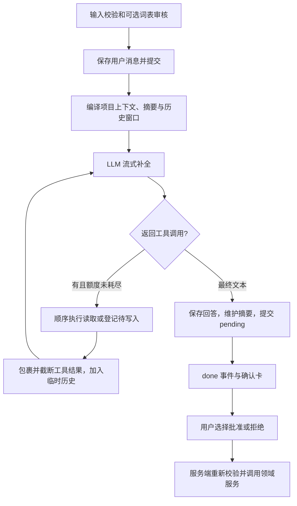

# Agent 工程审阅（2026-09-12）

本报告对应当前工作区代码（含已有 R4–R6 未提交成果），不是未来能力说明。已实施的改变仅是 R6 记录的 Agent 测试隔离、客户端清理、格式和类型遗留修复。下文的改进均为建议，执行方案见 [待执行计划](../exec-plans/active/agent-reliability-and-memory.md)。当前设计权威仍是 [agent-system.md](agent-system.md)。

## 1. 总体判断与证据边界

项目已有可用的创作助理基础：项目隔离、可见图谱检索、数据库持久对话、滚动摘要、分段记忆文档、流式回答、轮末确认写入、运行日志与分层测试。它目前是**自写的有界 ReAct 风格循环**，不是 LangGraph/Agents SDK 驱动的持久化执行框架，也没有多 agent 调度、后台自主记忆管理或可靠的跨会话语义检索。

最应优先补的是权限覆盖、上下文硬预算、摘要覆盖可证明性和写入原子性。更换框架或先接向量库不能直接解决这些问题。

证据分类：下文“已有/没有”来自已检查的运行路径；“风险”是据代码推导出的失败场景，不表示已经在真实用户数据上发生；未对用户数据库做破坏性试验。432 个后端测试通过并不证明未覆盖的并发、崩溃和语义记忆场景安全。

主要代码入口：

| 责任 | 当前 owner |
|---|---|
| HTTP 与 SSE | `backend/app/agent/router.py` |
| 服务边界与对话生命周期 | `agent/service.py`、`agent/conversations.py` |
| 工具循环与轮次事务 | `agent/chat.py:stream_chat` |
| 上下文与摘要 | `agent/context.py`、`agent/prompts.py` |
| OpenAI 兼容调用、usage、JSON 修复 | `agent/llm.py` |
| 九个工具及参数校验 | `agent/tool_specs.py`、`agent/tools.py` |
| 批准/拒绝、旧草案兼容路径 | `agent/writes.py` |
| 记忆文档与存储 | `agent/documents.py`、`agent/models.py`、`agent/repository.py` |
| 前端会话与流管理 | `frontend/src/stores/agentStore.ts`、`components/agent-panel/` |
| Atomic Skill 独立执行管线 | `backend/app/skills/registry.py`、`skills/service.py` |

后文 `agent/` 均指 `backend/app/agent/`，函数名可直接定位。

## 2. 一轮对话究竟怎样运行

`router.chat` 校验会话存在后返回 StreamingResponse；`service.stream_chat` 传入统一配置；`chat.stream_chat` 自持数据库 session。

实现是 Python `async` 生成器、`while True`、OpenAI SDK 异步流和顺序 `for call`；没有任务队列、持久 checkpoint 或工具并行执行。所谓 ReAct 是“模型决定检索 → 工具观察 → 再回答”的控制方式，不是完整保存推理轨迹的框架。

默认配置为上下文估算预算 8000 token、历史 20 条消息、工具 4 次、pending 8 项、工具输出 2000 字符、请求超时 60 秒。实际运行值来自环境配置；本审阅不读取密钥。主模型与摘要轻模型可分别配置，默认名称相同，故默认配置不自动带来模型价格差。

超出工具额度时下一次请求不再提供工具。**额度并非严格逐调用上限**：`enable_tools` 在一批之前判定，一次返回 10 个调用仍可能全执行；没有单独的最大补全次数、整轮 deadline 或重复工具签名检测。正常 provider 配合时循环可以结束，但面对异常批量响应不能宣称具备硬上限。

最终只保存用户消息、最后一次回答、最后回答阶段的 reasoning/usage；中间工具调用和结果主要留在内存，不构成可重放审计日志。流中前置文字可能已显示，但回读后只剩最终回答。`draft/doc_patch/ask_user` 有常量或预留事件，前端明确忽略，不等于已实现交互 hook。

## 3. 记忆分层与存储

| 层 | 实现 | 生命周期及局限 |
|---|---|---|
| 世界事实 | entities/relations，经 perspectives 读取 | 项目世界模型是事实来源，不应复制到记忆造成双重事实源 |
| 当前工具观察 | 本轮内存 messages | 轮结束没有完整持久化，不能跨会话复用工具轨迹 |
| 对话原文 | `messages` | 数据库长期保留到删除；当前上下文仅取尾窗 |
| 对话压缩 | `conversations.summary` + `summary_until_id` | 每会话单个滚动摘要，覆盖旧版本；没有摘要版本链或证据清单 |
| 项目长期工作指导 | `memory_docs` + `memory_doc_sections` | 同项目会话共享，人工或批准的 agent 工具维护 |
| 全局偏好/跨会话回忆 | 尚未实现 | F15 为 `not_started`；不能把项目共享文档等同完整长期记忆体系 |

现有记忆文档模板仅 `positioning`、`style`，各四个有序 section。指导类在服务里查重限制每项目一份；模型没有对应数据库唯一约束，竞争创建仍需验证。文档和段均有 `version`，段有 `updated_by`；内容 digest 是 SHA-256 前 8 位，用来提示变化，不是语义摘要，也不是自动冲突合并机制。

R4–R6 已增加 Artifact/Production 等领域，不能据此说聊天 agent 自动读到了剧本、workflow gate 或 narrative-state。当前聊天 context/tools 没有把这些领域集成为检索工具。作品正文更适合继续由 Artifact/Production 管理，避免再放进 memory_docs 形成第二份正文。

## 4. 压缩过程，是否保证不丢关键信息

`context.maintain_rolling_summary` 在最终回答保存后运行：从游标之后取消息，超过历史窗口的部分与旧摘要拼接，调用 `llm.summarize`，要求保留“创作决策、作者意见、未决问题、关键设定”。非空结果替换摘要，并把游标推进到溢出部分最后一条消息；异常或空白结果不改摘要和游标。

这防止了“摘要请求失败却宣称已压缩”的一种错误，**没有无损保证**：

1. 成功返回的非空摘要也可能漏掉否定、数字、专名、承诺或未决事项；目前没有结构化约束、来源引用、覆盖率校验、关键项保留校验或摘要回归评估。
2. 下一轮 `assemble_chat_context` 无论摘要成功与否仍执行尾窗截取。摘要失败积压的未覆盖消息可能不进 prompt。这是上下文可见性丢失，原文未从数据库删除。
3. `assemble_messages` 超预算先去文档全文，再丢整个摘要，再裁旧历史。摘要中的重要决策可能被整段移除。
4. 摘要以“旧摘要再摘要”迭代，语义偏差可逐轮积累；单一摘要没有历史版本供比较或回滚。
5. 摘要输入、输出没有单独预算；积压恢复时可能把很长的原文一次送入轻模型。摘要在提交回答之前执行，慢摘要会推迟 done 和回答持久化。
6. 摘要 cursor 找不到时回退到全部消息尾部，没有显式损坏告警；摘要更新没有会话并发版本保护。

建议保障目标不是“自然语言压缩绝对无损”，而是“关键状态可追溯、可重建、缺口可检测”：保留原始消息；维护带 source IDs 的决策/约束/未决任务清单；关键精确值保留原文或结构化字段；摘要版本化；游标只能在覆盖校验通过后前移；失败时用确定性摘要或有界原文补回，并显式报告覆盖缺口。不能为了塞进预算静默丢弃强制约束。

## 5. 跨会话一致性、长期记忆如何收集和检索

当前新会话会读取同项目最新文档和图谱，因此已批准的项目指导能够共享；其他会话的 summary/messages 不会被自动读取。不能保证“上个聊天说过的要求，新聊天自然记得”。只有将该要求保存成项目文档或事实，才有现成的共享路径。

收集方式目前是用户手编，或模型调用 `create_memory_doc` / `write_doc_section` 生成 pending，用户批准。没有每轮结束后的固定提取器、后台归纳、自动去重、置信度/重要性排序、时效淘汰、记忆来源链或全局用户偏好表。

检索方式是每轮读项目全部文档与 section，预算充足时注入全文，不足时只留目录；模型可按 `doc_id + seq` 读取具体段。没有关键词检索记忆工具、向量召回、跨会话摘要搜索或时间线搜索。先全量读取再裁剪还会产生数据库读取成本，每文档一次 section 查询是 N+1 形态。

建议保持“世界事实、项目决策、用户全局偏好、临时任务状态”不同作用域。提取器只生成有来源的候选记忆，记录 source message IDs、项目/视角、版本、时间、状态和替代关系。重复内容可合并来源；矛盾内容进入冲突队列。全局偏好须由明确的用户表达支持，不能从剧中人物台词推断用户本人喜好。

跨会话召回先做项目与可见性过滤，再按实体/关键词/时间/重要性选择带来源的片段，最后才考虑向量增益；索引必须可从主库存量重建。召回结果必须区分作者明确决定、agent 建议、已废弃决定和推测。没有证据时应说不确定并询问，而不是补造记忆。

## 6. 记忆冲突与并发保护的真实强度

`documents.update_section` 比较请求的 `expected_version`，不一致则 409；成功写段并增加段/文档版本。工具登记阶段捕获 `section_id + expected_version`，批准时重查。已覆盖“用户先编辑，随后批准旧草案”的顺序冲突测试。

但目前是“读取版本 → Python 比较 → ORM 写回”，不是数据库 `UPDATE ... WHERE version = expected` 并检查 rowcount，也没有 ORM version mapper。不能把这称作已证明的并发原子 CAS。双连接竞争、SQLite 锁冲突、文档版本并发累加都需独立测试。

还有更早的空档：`read_doc_section` 不返回版本，`write_doc_section` 在生成完成后的登记时才抓版本。如果用户在模型读取之后、登记之前修改，模型生成的旧内容可能搭上较新版本。应把模型实际读取的 revision/version 作为写入前置条件贯穿整条链。

这类版本冲突与语义冲突不同：两条同版本记忆分别说“主角不能杀人”和“主角必须杀人”，当前没有自动发现/裁决。建议显式记录 supersedes/disputed 状态和决策范围，事实以所属领域来源为准；不能让“最后写入”默认成为剧情真相。

## 7. 记忆丢失时怎么办，删除对话影响什么

先区分四种情况：数据还在但没召回；摘要误压缩；用户/agent 误覆盖；物理删除或数据库故障。

当前可用恢复路径：从会话消息 API/界面找原文，重新读项目文档和图谱，让用户将确认的信息写回目标段；Artifact 有 revision 路径可供检查。当前没有专门“从原文重建摘要”的 API/后台作业，也没有 memory section 历史版本表；不应建议盲目清空摘要或覆盖生产数据库。原文已删除且没有备份时，模型不能恢复可信内容。

删除会话会删除该会话自身摘要、messages 和 pending 行；**不会删除已批准写入的项目 memory_docs、实体或关系**，因为这些属于项目，没有会话外键。删除项目通过领域清理删除该项目会话与记忆文档；删除记忆文档级联删除其 sections。当前没有“删除对话并撤销其所有知识影响”的来源追踪或遗忘传播。

前端删除会话只清理了部分 map，pending/draft 缓存未同时清空。后端有 listPendingWrites API，但 agentStore 的会话加载未使用它；刷新后已有 pending 可能没有确认卡。应将“状态已存库”和“用户能恢复操作”分开验收。

建议增加恢复入口、来源回查、摘要重建和可验证备份恢复演练。若提供“同时遗忘派生记忆”，删除前展示引用影响；已独立成为用户作品或多来源共享的内容不能悄悄级联删除。检索索引、缓存、来源引用的删除传播必须纳入同一语义。

## 8. 上下文组织、溢出与预防

当前顺序：系统角色和规则 → 项目上下文（文档全文、图谱目录、文档目录、会话摘要）→ 尾窗历史 → 本轮输入。当前用户输入已保存，组装时按 ID 排除再追加一次，已有测试保证不重复注入。reasoning 不回传作普通历史。

预算估算是 CJK 每字 1 token，其他每 4 字符约 1 token；这只是启发式，不保证上界。统计只看文本，没有完整计入 tool schemas、协议字段、消息开销、后续工具参数/结果、输出和模型推理预留。`agent_context_max_tokens` 是应用配置，不自动验证 provider 的真实容量。

输入 API 限 8000 字符，但字符上限不是 token 上限；图谱和文档目录自身可以很大。system、目录和末条输入即使加起来超预算也仍返回消息，因此没有“请求前必定符合上限”的强保证。工具循环追加结果后不重新编译预算；单工具字符截断只能控制单项，不能控制全轮累计。截断无分页 continuation token，模型可能看不到结果尾部。

应在**每次 provider 调用前**统一预算，包含工具契约、输出预留和安全余量；不可裁核心超限时不发请求，返回具体的拆分提示。按结构裁剪成对工具调用/结果，不能留下孤立 tool 消息。目录需分页或相关性召回，长输入走分块提取/附件式读取；摘要走独立输入输出预算。容量条应提供发送前风险和发生过的裁剪说明，而不只是收到末轮 usage 后显示比率。

## 9. 缓存命中与成本

已有明确缓存意识：稳定 system 在前，项目内容其次，历史在后；图谱仅先给目录；文档支持按段读写；摘要走可配置轻模型；记录 provider usage。项目名和可变数据同在 system/早期前缀中，项目任意文档变动会改变后续长前缀；排序的稳定性并非全链路明确契约。

没有 cached input token 指标、实测命中率、费用归因、每轮所有调用用量汇总、硬成本预算或模型能力表。当前最终消息只保留最后一次调用 usage，低估工具多轮和摘要总成本；日志会记录各调用但缺少完整的同一 run 聚合关联。不能据前缀顺序宣称已达到高命中或成本最小。

代码未显式配置 SDK retries，本地安装 SDK 默认重试 2 次；这属于传输层，不是项目工具自纠政策。默认超时不等于整轮总时限。成本分析应把重试、失败调用、摘要调用都计算在内。

建议按质量约束优化：固定规则/契约版本稳定排序；项目可变数据作为独立片段；记录 cached_tokens（未知记未知）、模型、延迟、各用途 token；对同一问题比较总费用、首次 token 延迟、记忆召回质量。避免每次小幅溢出都重写摘要，可用有界批次和异步维护降低成本；缓存键必须含项目、视角、角色、内容版本与策略版本，防止错误复用泄漏。

## 10. 工具调用错了或失败如何处理

九个工具：`search_entities`、`get_entity_detail`、`get_neighborhood`、`read_doc_section`、`create_entity`、`update_entity`、`create_relation`、`create_memory_doc`、`write_doc_section`。

未知工具、坏 JSON、非对象参数、写参数 Pydantic 校验失败返回“问题/原因/修复”文本，作为 tool result 让模型自纠。读取类参数较宽松（如字符串转换），写参数 extra=ignore 丢弃额外字段。业务里明确处理的不可见/不存在也返回错误文本；未处理的 DB/运行时异常上抛至整轮回滚。这比函数 docstring 所说“全部失败都折叠为文本”更窄。

语法正确却选错工具或改错语义，当前没有意图一致性验证；主要靠写入只登记和用户确认限制损害。读工具无法靠确认卡补救已泄露信息。没有工具级超时、typed error 分类、同参数重复次数上限、逐工具熔断、重试安全声明或“调用结果未知”的恢复状态。

建议工具契约显式声明读写性质、scope、参数/输出 schema、可重试性与幂等键。只对明确可重试的读取/传输失败做少量退避；写失败先查已提交状态，不能自动再写。未知工具反馈可用名称一次或少量次数，重复相同失败后停下要求调整。工具名和结果均作为低信任数据，错误不要回显秘密。

## 11. 图谱检索和其他领域协作

`entities.repository.search` 用名称/别名子串匹配（SQLite JSON aliases），之后 `perspectives.filter_entities_for_agent` 再过滤可见实体；详情也走过滤服务。邻域通过获取当前可见全图，再提取目标的一度边。目录提供 id/type/name/aliases，不含全部属性；详细字段按需读。

没有向量检索、多跳规划、路径解释、相关性重排、结果分页、检索去重或显式 recall 评估。`_resolve_entity_by_name` 对名称/别名精确匹配，遇到多个可见同名实体选首个，不提示歧义。一度邻域每次加载整图在规模增长时成本高。

建议先让搜索返回限量带 ID/类型/来源的候选，重名时要求选择；限定 hop、节点数、边类型与 token；尽量在查询时缩小范围，并保持 perspectives 为可见性权威。后续通过公开服务整合 Artifact revision、Production、Narrative-state 查询，明确世界事实、角色相信和观众知道的区别，不用记忆摘要取代 narrative-state。

## 12. 强制 hook / 机器校验在哪里，为什么在那里

| 边界 | 当前校验 | 为什么在此处 | 真实覆盖范围 |
|---|---|---|---|
| API 输入 | Pydantic、长度与字段类型 | 在昂贵模型调用之前阻断坏输入 | 未形成用户身份/多租户授权体系 |
| 输入审核 | 可选关键词词表 | 在持久化和发送前拦截输入 | 默认关闭，仅输入词匹配 |
| 图谱读取 | perspectives 过滤 | 数据进入模型前限制可见信息 | 未覆盖全部记忆/历史路径 |
| prompt 组装 | data wrapper、预算裁剪 | 降低数据被解释为指令的概率并控制容量 | prompt 软防线，不是权限沙箱 |
| tool dispatch | 工具白名单、JSON、写 DTO、项目约束 | 不信任模型函数名与参数 | 不是语义意图校验；运行时错误未全局工具级恢复 |
| 写入登记 | 只保存 pending、数量上限 | 模型不能直接提交世界模型 | pending 与用户回答最终一起提交 |
| approve | 归属、状态、类型、段版本复核 | 用户批准与执行之间状态可能已变 | 项目复核已有；视角未随 pending 持久化，原子性不足 |
| Atomic Skill | registry、scope、context key、schema 子集、gate、facts/protected 校验 | 在候选保存和领域写入前收窄影响 | 独立路径，不能等同覆盖聊天工具 |
| 服务观测 | `@checkpoint`、emit_event、异常/SSE 转换 | 统一诊断边界 | 日志不是可恢复执行 checkpoint |
| 数据库/开发检查 | FK/WAL、架构测试、import-linter、Ruff/mypy、功能验证 | 防结构回归和跨域私有访问 | 测试通过不等于语义与崩溃安全证明 |

目前没有统一的可插拔 pre-model/post-model/pre-tool/post-tool/pre-commit 生命周期策略器；存在的是散布在明确边界的普通函数/装饰器。建议保留这些强边界，将必须执行的策略集中编排并记录结果，而不是让模型自行选择是否执行“审核工具”。

## 13. 安全审核还有什么缺口

输入关键词不是完整内容审核，没有输出审核、工具载荷统一安全复核或秘密检测。文本流直接转发，若以后要求强输出审核，需定义先缓冲再审核的延迟代价。项目数据 wrapper 只是模型提示；文档目录标题和项目名仍进入系统文本，不能称作完全抵御提示注入。

更关键的是跨视角：`ChatRequest` 每轮选择 perspective，但 Conversation/Message/summary 没有保存对应视角标签，组装时也不重审旧回答。先 author 询问秘密，再以 audience 在同会话继续，旧消息/摘要可把秘密带入。所有项目 memory sections 也无角色/观众权限标签，会直接注入或被读取。图谱过滤不能单独兜住这种间接路径。

应先定义作用域：视角切换是独立上下文，或对带 provenance 的历史逐项投影；无法证明可见的派生摘要默认不向更窄视角暴露。对记忆、缓存、工具错误、摘要和检索都使用同一策略。当前本地应用 API 未展示完整登录主体/角色权限模型；若扩为多人服务需另立授权边界，不能把 project_id 检查等同用户授权。

## 14. 单段修改怎样实现

记忆文档已支持：定位 `doc_id/seq` → `read_doc_section` → `write_doc_section` 仅提交该段内容 → pending 卡批准 → `documents.update_section`。用户编辑器通过 `section_id + expected_version` PATCH。此处“段”是固定 section，内容可能含多个自然段；不是任意光标选区编辑。

作品正文已有 Artifact block revision 编辑，R6 `edit_block` adapter 调用 `edit_structured_block`。会产生新 revision，其他 block 保持，依赖标 stale。当前普通聊天工具未接入该路径，不能说在聊天中提一句“只改这一段”就会可靠调用它。

建议选区请求带 artifact_id、block_id、base revision/hash、选区原文/稳定锚点及允许修改范围；候选展示精确 diff，提交前强制校验未选部分和保护片段未变。失败时重读并重生成，禁止降级成全文覆盖。对 memory section 同样把真实读取版本传到底；保留用户可撤销的 revision。

## 15. Atomic Skills 与 agent 的连接程度

R6 registry 要求六类文件存在，加载 manifest/schema，并只允许三个 validator 名和三个 commit action。执行接口接收外部传入 candidate，没有在管线中调用模型；`prompt.md`、各 `validators.py` 的存在不等于当前会执行其内容。当前校验逻辑集中在 `skills/service.py`。

schema 校验只是顶层 required 和部分 type，不是完整 JSON Schema：没有递归、enum、additionalProperties 等通用语义，number 的 Python isinstance 还会接受 bool。context 只检查 required 缺失和 denied key，没有剔除未声明的额外 key，也没有从服务端解析引用验证其真实权限。gate_id 可空，gate_facts 是入参，不能当权威事实。

facts/protected_spans 目前比较输入输出附带的同名字段，相等不证明 candidate 正文确实保留这些事实/片段。impact 是声明的 writes/forbidden/scope 元数据，不是内容语义的完整影响分析。accept 不绑定生成时 artifact revision，也没有完整重跑当前 gate/policy 的逻辑。

这些是比 R6 文档概括更窄的实际保证，属于本次新审阅的待办；并非用户本次要求先修复的那几项已记录遗留。新计划应先强化契约/接受边界，再把 skill 以受控适配器接入聊天，继续保留人类确认，不让模型任意串技能或自推进阶段。

## 16. 稳定性、事务与故障恢复

已有用户输入先 commit、失败回滚当前回答/pending、SDK 错误转 AgentError、SSE error、前端 AbortController、应用 shutdown 清理、数据库 WAL/FK，以及覆盖基本业务的测试。这让一般失败可见且用户输入不易丢失。

重要剩余风险：

- approve 调用的 entities/documents 等 service 自行 commit，然后才写 `row.status=approved` 并再次 commit。中间崩溃会出现业务已写入但仍 pending，重试可重复创建。Skill accept 的领域写入也有类似分次提交。
- 只有前端单流守卫；多标签页/直接 API 可并发操作同会话。同一 SQLite session 在模型长等待期间保持事务，登记 flush 后继续等待还会延长写锁占用。
- 没有持久 run 状态、幂等 turn key、SSE event ID/replay、完成 ACK 或中断后续传。连接结束不等于成功完成；前端未要求收到 done 才认定正常结束。
- 显式 stop/项目切换靠中止 fetch；服务端没有持久 cancelled 状态与可查询结果。SDK 流对象也没有明确的 finally close 管理，需测试取消时连接释放。
- store 中旧请求的 finally 和回读没有统一 generation/run ID，切项目再发起新流时可能出现旧收尾覆盖新状态的竞争。
- 客户端仍是进程单例，适合当前单 lifespan 模型；本次修复不等于已经支持多事件循环共享连接池。关闭异常仍上抛，也可能阻止其后数据库清理，需后续独立 shutdown 清理设计。

应为写入建立共享事务/UoW 与幂等唯一约束；为 run 建立 queued/running/waiting_confirmation/completed/failed/cancelled 等明确状态，事件序号与结果回查；先保存回答再独立维护摘要；采用服务器会话并发控制、工具时限和总时限。故障注入验证“提交后断网”“提交间崩溃”“取消时 flush”“重复批准”“两个连接同时写”，这些比新增更多 happy-path 测试有价值。

## 17. 优先级与实施取舍

| 优先级 | 改进 | 验收焦点 |
|---|---|---|
| P0 | 全链路视角/项目权限 | author 秘密不从旧历史、摘要、文档、缓存泄露给 audience |
| P0 | 每次调用硬预算与严格工具配额 | 超预算不调用 provider；批量工具也不能突破额度 |
| P0 | 批准原子性、版本与幂等 | 崩溃/重试/并发不重复写，不覆盖新版本 |
| P1 | 摘要覆盖与来源、原文检索/重建 | 摘要失败不静默遗漏关键状态；可恢复可解释 |
| P1 | 持久运行与前端恢复 | 刷新可继续处理 pending，断流可判定最终状态 |
| P1 | 项目长期记忆与跨会话召回 | 只提升有来源的决定，冲突可见，可删除可追踪 |
| P1 | 单块编辑与 Skill 边界强化 | diff、base revision、真正保护区检查、服务端 context/gate |
| P2 | 召回效率、缓存与成本 | 在质量基线不退化前提下减少 token/查询/延迟 |

不建议现在默认引入向量数据库、多 agent、通用分布式工作流、自动记忆覆写或自动接受。先在现有模块化单体中完成可观察、可校验、可恢复的边界；需要更复杂基础设施时以规模和评估证据决定。

## 18. 本次已实施修复及验证

R6 已记录遗留：`tools._resolve_entity_by_name` 返回类型 bool 误标改为 str；chat 与 service 单测格式规范化；service 单测统一 stub summarize 并拒绝创建真实 LLM client，堵住历史上下文用例遗漏 mock 的路径；dispose_client 先清空引用再关闭，关闭失败不保留失效单例；增加成功/失败关闭两例。

初始全后端运行 430 passed，未在本环境稳定复现历史 Event loop is closed；代码定位出的未 mock 摘要路径已隔离，不能把未复现说成已复现。最终后端 432 passed；73 个定向用例通过；mypy 87 文件、Ruff check/format、16 条 import-linter 契约通过。只余既有 Starlette 弃用警告（非 R6 指定遗留）。未修改真实数据、迁移、前端业务或 feature 状态，未提交已有工作区修改。
